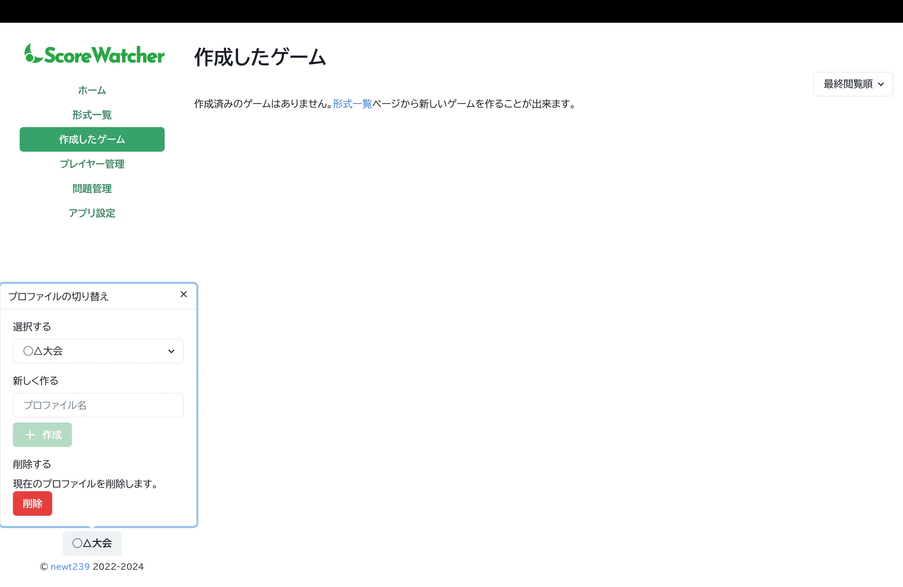

ゲームやプレイヤー、問題データを大会ごと等で分類できる機能です。デスクトップサイズの画面でのみ利用できます。

## どんな機能？

Score Watcherを長く利用していると、フリバや大会等、様々なプレイヤーが参加する様々なゲームが作成されていきます。現在の UI では、多くのゲームを分類する機能が不十分であるため、大会運営の際などは操作性が低下してしまうことが考えられます。

そこで Score Watcher では、プロファイルの切り替えという機能を導入しました。プロファイルは、ゲームやプレイヤー、問題データを大会ごと等で分類できる機能です。プロファイルを切り替えることで、シーンごとにデータを分けて管理することができます。

## 使い方

1. 画面左下の「デフォルト」ボタンをクリックします。
2. 「新しく作る」からプロファイルの名前を入力し、「作成」をクリックします。
3. プロファイルが自動で切り替わります。

