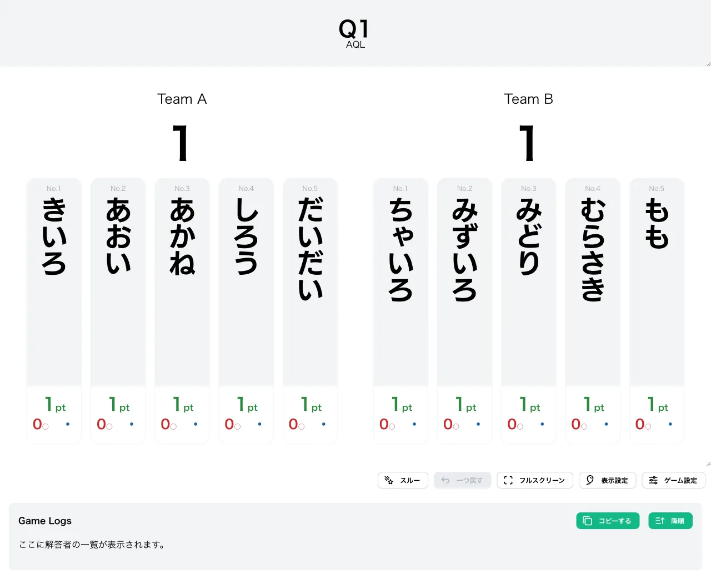
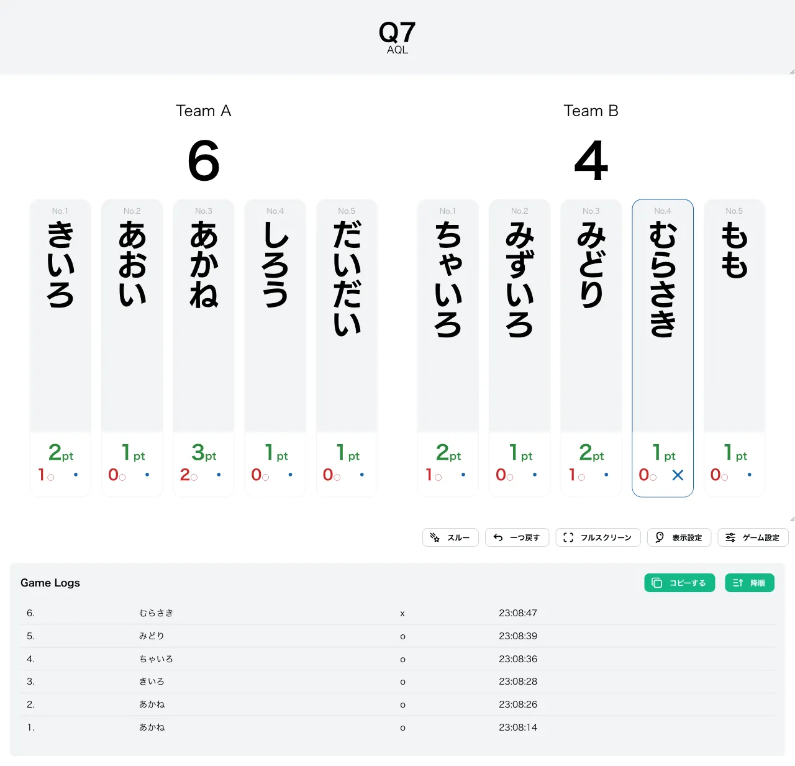

import { Aside } from "@astrojs/starlight/components";

import CreateGameButton from "../../../components/CreateGameButton.astro";

10 人のプレイヤーが 2 つのチームに分かれて対戦するチーム戦形式です。各プレイヤーのスコアを掛け合わせた「チームスコア積」が **200 以上**になったチームが優勝します。

クイズ大会「AQL（Academic Quiz League）」で実際に使用されている形式を再現しています。

<Aside type="caution" title="注意">
  AQL 形式はプレイヤー数が **必ず 10 人** である必要があります。10
  人以外ではゲームを開始できません。
</Aside>

<CreateGameButton rule="aql" players={10} />

## チーム分け

登録した 10 人のプレイヤーは、登録順に次のように 2 チームへ自動的に振り分けられます。

| 並び順              | チーム           |
| ------------------- | ---------------- |
| プレイヤー 1〜5 番  | 左チーム（左側） |
| プレイヤー 6〜10 番 | 右チーム（右側） |

チーム名は[変更可能なオプション](#変更可能なオプション)で自由に設定できます。

## ルール

### スコア計算

各プレイヤーは **スコア 1** からゲームを開始します（他の形式と異なり 0 ではなく 1 始まりです）。正解するたびにスコアが 1 増え、スコアは「正解数 ＋ 1」と一致します。

各チームのスコアは、所属する 5 人のスコアを **すべて掛け合わせた積** で表されます。

```
チームスコア積 = プレイヤーAのスコア × プレイヤーBのスコア × … × プレイヤーEのスコア
```

### 誤答とリーチ・失格

AQL 形式の誤答処理は 2 段階です。

1. **1 回目の誤答**: そのプレイヤーは「誤答リーチ」状態になり、スコアが **1 にリセット**されます。
2. **2 回目の誤答**: 誤答リーチ状態のまま再び誤答すると **失格**となり、解答できなくなります。

失格すると、それまで積み上げたスコアは失われます。

### 復活システム

AQL 形式最大の特徴が **自動復活**です。失格しているプレイヤーがいる状態で、**相手チーム**のプレイヤーが誤答すると、失格者は即座に復活します。

- スコアは 1 に戻り、再び解答できる「プレイ中」状態になります。
- 誤答リーチ状態も解除されます。

味方の復活を狙って相手チームの動向を読む、というチーム戦ならではの駆け引きが生まれます。

### 勝敗の判定

- **勝利**: 自チームのスコア積が **200 以上**になったチームが優勝します。
- **敗北**: 相手チームのスコア積が 200 以上になる、または自チームの失格者が 5 人に達すると敗北となります。

## 変更可能なオプション

### チーム名（left_team / right_team）

左チーム・右チームそれぞれの表示名を設定できます。初期値は左チームが「Team A」、右チームが「Team B」です。得点表示画面の各チーム上部に表示されます。

### 限定問題数の設定

出題する問題数を制限できます（共通設定）。

## 操作方法

1. [形式一覧](/rules/)で「AQL」の「作る」をクリックします。
2. プレイヤーを **10 人**選択し、問題セットを設定します（詳しくは[最初のゲームを作ろう](/guides/example/)）。登録順の前半 5 人が左チーム、後半 5 人が右チームになります。
3. 必要に応じてチーム名（left_team / right_team）を設定します。
4. 得点表示画面で、各プレイヤーの正解／誤答ボタン（またはキーボードの数字キー／Shift＋数字キー）で採点します。

得点表示画面では、各チームの上部にチーム名とチームスコア積（または勝敗結果）がリアルタイムで表示されます。各プレイヤーの正解数は「◯pt」形式で表示され、失格者には休み表示、勝ち抜けチームには順位が表示されます。

## スクリーンショット

### 初期状態



### プレイ中の様子

各チームのスコア積が更新され、左右に分かれたチームごとの状況が表示されます。



## この形式で遊んでみる

下のボタンから、この形式のゲームをすぐに作成して試すことができます（AQL は 10 人で開始します）。

<CreateGameButton rule="aql" players={10} />
