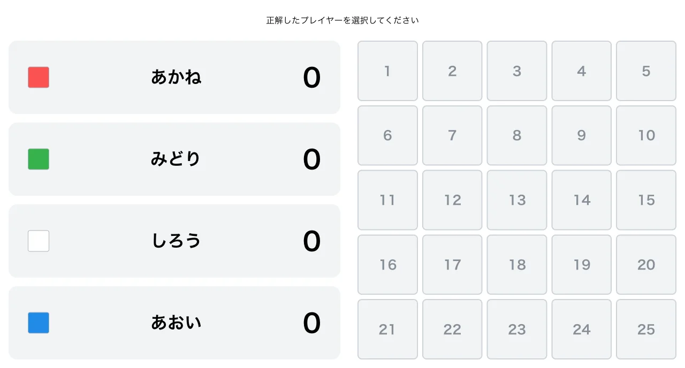
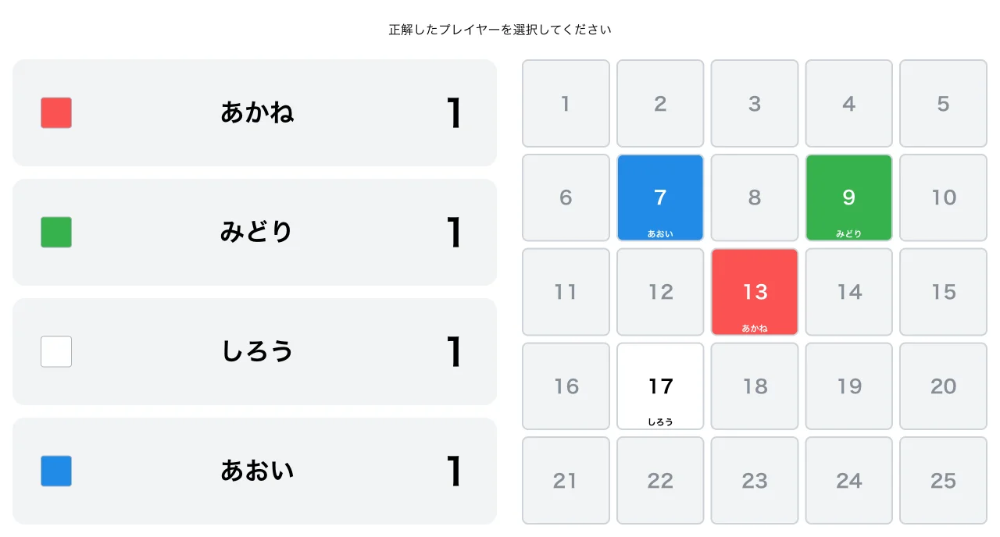

import { Aside } from "@astrojs/starlight/components";

4 人のプレイヤーが、正解するたびに 5×5＝25 枚のパネルを 1 枚ずつ獲得します。獲得したパネルと自分の既存パネルで相手のパネルを挟むと、オセロのように挟まれたパネルが自分の色に反転します。すべてのパネルが埋まったとき、最も多くのパネルを獲得しているプレイヤーが優勝です。

テレビ番組「パネルクイズ アタック25」で実際に使用されている形式を再現しています。

<Aside type="caution" title="注意">
  アタック25 形式はプレイヤー数が **必ず 4 人** である必要があります。4 人以外ではゲームを開始できません。
</Aside>

## プレイヤーの色

プレイヤーには登録順に次の色が割り当てられます。

| 並び順      | 色  |
| ----------- | --- |
| プレイヤー1 | 赤  |
| プレイヤー2 | 緑  |
| プレイヤー3 | 白  |
| プレイヤー4 | 青  |

## ルール

### パネルの獲得

各問、正解者は空いているパネルを 1 枚指定し、自分の色で点灯させます。指定したパネルと自分の既存パネルで相手のパネルを挟むと、オセロのように 8 方向それぞれで挟まれた相手のパネルが自分の色に反転します。空きマスや盤端があると、その方向の連鎖は途切れます。

### 中央スタート

最初の問題の正解者は、**必ず中央のパネル（13 番）からスタート**します。盤面が空の状態では、13 番以外のパネルは選択できません。

### パネルの選択制約

2 手目以降は「はさめる所があれば、必ずはさめるパネルをとる」というルールに従い、獲得できるマスが次のように制限されます。選択できないマスはクリックできません。

1. **反転できるマスがある場合**: 反転（挟み）が発生するマスのみ選択できます。
2. **反転できるマスがない場合**: 点灯済みパネルに隣接（8 方向）する空きマスのみ選択できます。

### ゲーム終了

全 25 パネルが埋まったらゲーム終了です。最も多くのパネルを保持しているプレイヤーが優勝、それ以外は敗北となります。

最多保持プレイヤーが複数いる場合は、次の優先順位で順位を決定します。

1. 保持パネル数（多い方が上位）
2. 正解数（多い方が上位）
3. 誤答数（少ない方が上位）

3 項目すべてが同じ場合は同順位となります。

## 変更可能なオプション

### アタックチャンス

ゲーム終盤に発生する特別ターンです。初期値は有効に設定されています。

残りの空きパネルが **5 枚以下** になった状態での次の正解者がアタックチャンスの対象となります。対象者は通常通りパネルを獲得した後、点灯済みのパネルを **1 枚消す（空きに戻す）** ことができます。消去は任意でスキップも可能です。アタックチャンスはゲーム中 **1 回のみ** 発生します。

## 操作方法

アタック25 形式では、正解者を先に選んでからパネルを指定します。

1. **正解者のプレイヤーカードをクリック** して正解者を選びます。
2. **獲得するパネルをクリック** します。選択可能なパネルのみクリックでき、獲得とオセロ反転が行われます。
   - アタックチャンス対象の場合は、続けて消すパネルを選択するモードに移行します。
3. **消去モード** では、点灯済みパネルをクリックして消去するか、「消さずに確定」ボタンでスキップします。
4. 誤答の場合は、プレイヤーを選択した状態で **誤答ボタン** を押します（盤面には影響しません）。

<Aside type="note">
  パネルの指定が必要なため、数字キーによる正誤入力は無効化されています。「一つ戻す」「スルー」のキー操作は利用できます。
</Aside>

## スクリーンショット

### 初期状態

### プレイ中の様子

各プレイヤーが獲得したパネルが、それぞれの色で点灯します。

