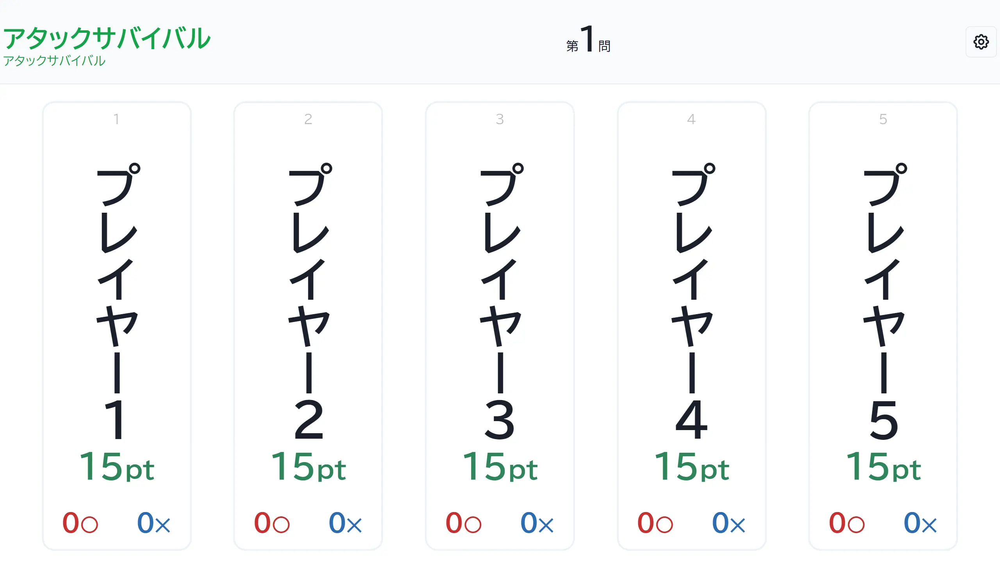

ゲームの進行とともに各プレイヤーのポイントが減っていく形式です。

プレイヤーは各自 N ポイントを持った状態で開始します。正解すると他の回答者全員のポイントを X ポイント減らすことができ、また誤答すると自分のポイントが Y ポイント減ります。ポイントが 0 になった時失格となります。

## 変更可能なオプション

### 共通初期値

プレイヤーがゲーム開始時点で持っているポイントです。初期値は `15` に設定されています。

### 自分が正答

特定のプレイヤーが正答した際に、当該プレイヤーのポイントをどう変動させるかを設定できます。初期値は `0` に設定されています。

### 自分が誤答

特定のプレイヤーが誤答した際に、当該プレイヤーのポイントをどう変動させるかを設定できます。初期値は `-2` に設定されています。

### 他人が正答

特定のプレイヤーが正答した際に、当該プレイヤー以外のプレイヤーのポイントをどう変動させるかを設定できます。初期値は `-1` に設定されています。

### 他人が誤答

特定のプレイヤーが誤答した際に、当該プレイヤー以外のプレイヤーのポイントをどう変動させるかを設定できます。初期値は `0` に設定されています。

### 限定問題数の設定

詳細は限定問題数をご確認ください。

## スクリーンショット

### 初期状態

