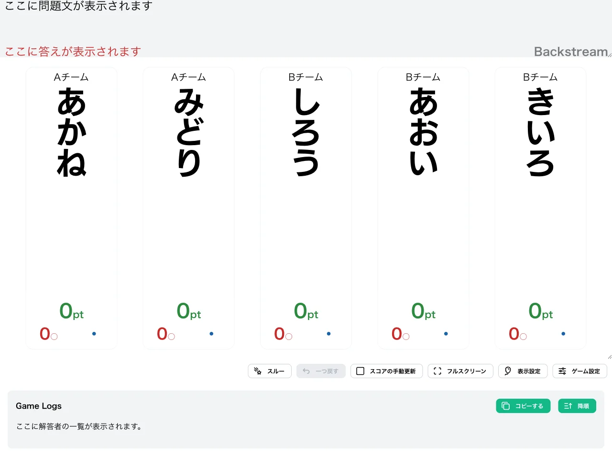
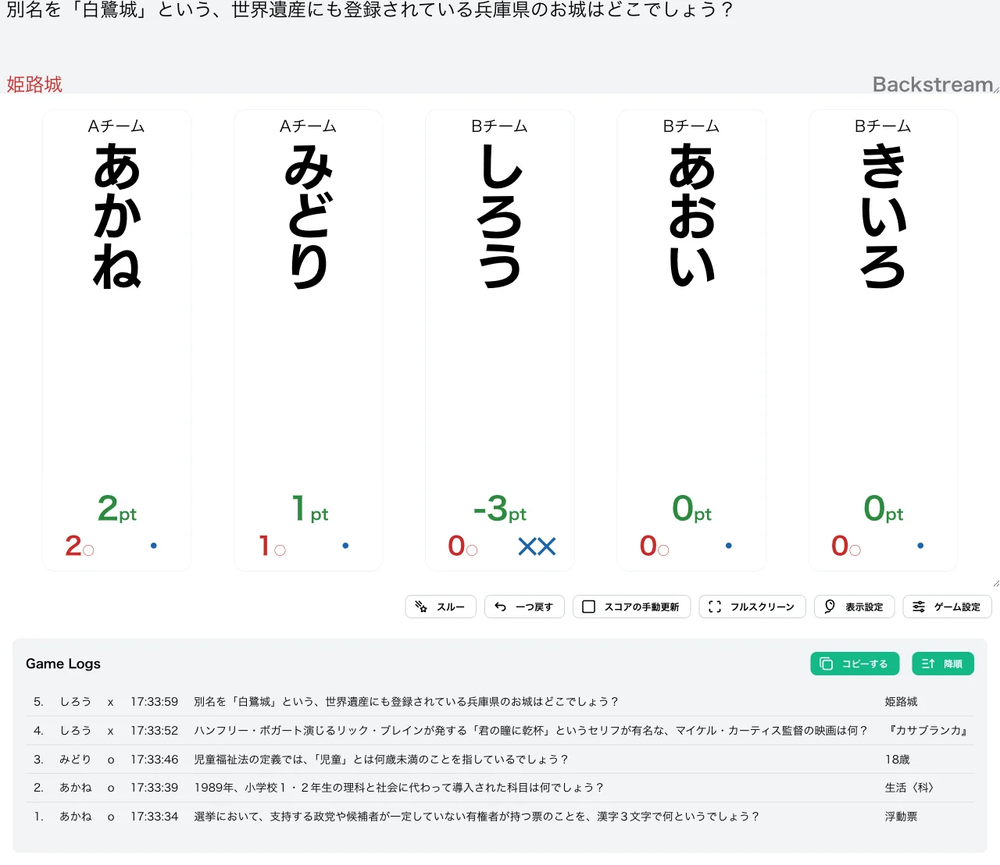
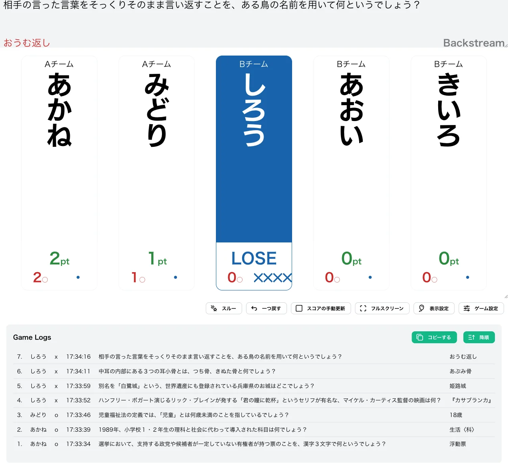
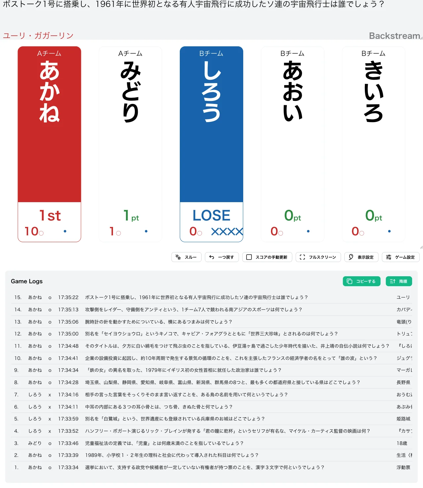

import CreateGameButton from "../../../components/CreateGameButton.astro";

誤答回数に応じて減点幅が増加する、独特なペナルティシステムを持つ形式です。各プレイヤーは 0pt からゲームを開始し、1 回の正解で +1pt、n 回目の誤答で −n pt という累積的なペナルティを受けながら、10pt での勝ち抜けを目指します。

誤答を重ねるほどスコアの下落が激しくなり、スコアが −10pt 以下になると失格となるため、慎重さと正確性が重要となる戦略性の高い形式です。

<CreateGameButton rule="backstream" players={5} />

## ルール詳細

### 勝利条件

スコアが勝ち抜けポイントに達すると勝ち抜けです。初期設定では 10pt で勝ち抜けとなります。

### 失格条件

スコアが失格ポイント以下になると失格です。初期設定では −10pt 以下で失格となり、失格したプレイヤーは以降の問題に参加できません。

### スコア計算

- **初期スコア**：各プレイヤー 0pt からスタートします。
- **正解時**：スコアに 1pt が加算されます。
- **誤答時**：その時点での累計誤答回数の分だけスコアが減算されます。1 回目の誤答では −1pt、2 回目では −2pt、n 回目では −n pt となります。

誤答回数が増えるほど減点が大きくなるため、後半の誤答ほどスコアへのダメージが深刻になります。

#### 計算例

0pt から始めて、次のように採点が進んだ場合のスコア推移です。

| 操作          | 計算  | スコア |
| ------------- | ----- | ------ |
| 開始          | —     | 0pt    |
| 正解          | 0 + 1 | 1pt    |
| 正解          | 1 + 1 | 2pt    |
| 誤答（1回目） | 2 − 1 | 1pt    |
| 正解          | 1 + 1 | 2pt    |
| 誤答（2回目） | 2 − 2 | 0pt    |
| 誤答（3回目） | 0 − 3 | −3pt   |

### ゲーム終了

設定された人数が勝ち抜けるか、全問題が終了した時点でゲームを終了します。

## 変更可能なオプション

### 勝ち抜けポイント

勝ち抜けに必要なスコアを設定できます。初期値は `10` に設定されています。

### 失格ポイント

失格となるスコアを設定できます。初期値は `-10` に設定されています。

### 限定問題数の設定

詳細は限定問題数をご確認ください。

## 操作手順

1. [形式一覧](/rules/)で「Backstream」の「作る」をクリックします。
2. プレイヤーと問題セットを設定します（詳しくは[最初のゲームを作ろう](/guides/example/)）。
3. 得点表示画面で、各プレイヤーの正解／誤答ボタン（またはキーボードの数字キー／Shift＋数字キー）で採点します。

## スクリーンショット

### 初期状態

全プレイヤーが 0pt の状態でゲームが始まります。

### プレイ中

正解でスコアが 1pt ずつ加算され、誤答では累計誤答回数の分だけ減点されます。下の例では「あかね」が 2 問正解で 2pt、「みどり」が 1 問正解で 1pt、「しろう」が 2 回誤答して −1pt、−2pt と引かれ、累計 −3pt（✕✕表示）になっています。

### 失格

スコアが失格ポイント以下になったプレイヤーは「LOSE」と表示され、以降採点できなくなります。下の例では「しろう」が 4 回目の誤答まで重ね、−1 − 2 − 3 − 4 で累計 −10pt となり失格しています。

### 勝ち抜け

スコアが勝ち抜けポイントに達したプレイヤーには順位が表示されます。下の例では「あかね」が 10pt に到達して「1st」と表示され、「しろう」は失格（✕✕✕✕）となっています。

## この形式で遊んでみる

下のボタンから、この形式のゲームをすぐに作成して試すことができます。

<CreateGameButton rule="backstream" players={5} />
