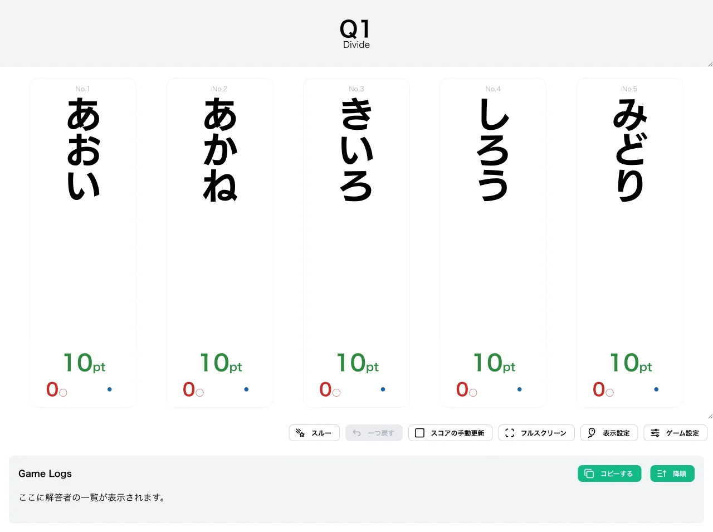
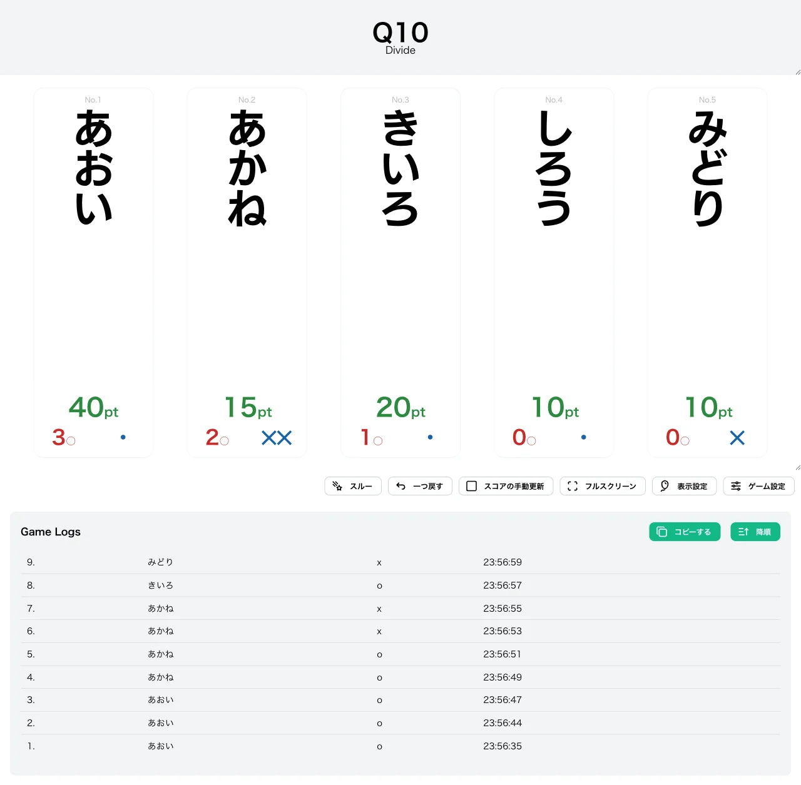
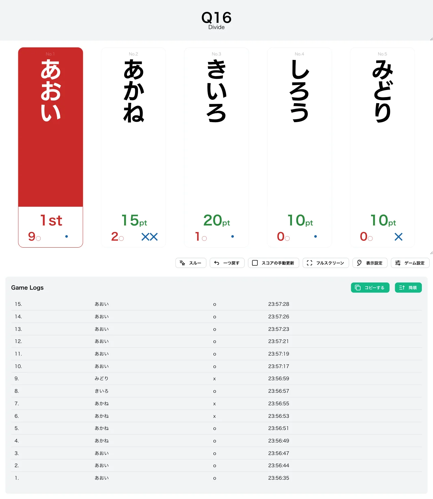

import CreateGameButton from "../../../components/CreateGameButton.astro";

誤答回数に応じてスコアの割る数が増加する、独特なスコア計算を持つ形式です。各プレイヤーは初期値として 10pt を持った状態でゲームを開始し、正解するごとに一定のポイントが加算されます。

誤答すると現在のスコアが誤答回数で割られるため、誤答を重ねるほどダメージが大きくなっていきます。失格は存在せず、スコアが 0pt に近づいてもゲームに参加し続けられるのが特徴です。

<CreateGameButton rule="divide" players={5} />

## ルール詳細

### 勝利条件

スコアが勝ち抜けポイントに達すると勝ち抜けです。初期設定では 100pt で勝ち抜けとなります。

### 失格条件

この形式に失格はありません。何回誤答してもゲームから脱落することはなく、最後まで競技に参加できます。

### スコア計算

- **初期スコア**：各プレイヤー 10pt からスタートします。
- **正解時**：スコアに 10pt（正解時加算ポイント）が加算されます。
- **誤答時**：現在のスコアをその時点での累計誤答回数で割ります（小数点以下は切り捨て）。1 回目の誤答ではスコア ÷ 1、2 回目では ÷ 2、N 回目では ÷ N となります。

誤答回数が増えるほど割る数が大きくなるため、後半の誤答ほどスコアの減少が深刻になります。

#### 計算例

10pt から始めて、次のように採点が進んだ場合のスコア推移です。

| 操作          | 計算    | スコア |
| ------------- | ------- | ------ |
| 開始          | —       | 10pt   |
| 正解          | 10 + 10 | 20pt   |
| 正解          | 20 + 10 | 30pt   |
| 誤答（1回目） | 30 ÷ 1  | 30pt   |
| 正解          | 30 + 10 | 40pt   |
| 誤答（2回目） | 40 ÷ 2  | 20pt   |

### ゲーム終了

設定された人数が勝ち抜けるか、全問題が終了した時点でゲームを終了します。

## 変更可能なオプション

### 勝ち抜けポイント

勝ち抜けに必要なスコアを設定できます。初期値は `100` に設定されています。

### 正解時加算ポイント

正解したときに加算されるポイントを設定できます。初期値は `10` に設定されています。

### 限定問題数の設定

詳細は限定問題数をご確認ください。

## 操作手順

1. [形式一覧](/rules/)で「Divide」の「作る」をクリックします。
2. プレイヤーと問題セットを設定します（詳しくは[最初のゲームを作ろう](/guides/example/)）。
3. 得点表示画面で、各プレイヤーの正解／誤答ボタン（またはキーボードの数字キー／Shift＋数字キー）で採点します。

## スクリーンショット

### 初期状態

全プレイヤーが 10pt を持った状態でゲームが始まります。

### プレイ中

正解でスコアが加算され、誤答では現在のスコアが誤答回数で割られます。下の例では「あかね」が 2 回正解（30pt）したあとに 2 回誤答し、30 ÷ 1 → 30、30 ÷ 2 → 15pt とスコアが減少しています。

### 勝ち抜け

スコアが勝ち抜けポイントに達したプレイヤーには順位が表示されます。

## この形式で遊んでみる

下のボタンから、この形式のゲームをすぐに作成して試すことができます。

<CreateGameButton rule="divide" players={5} />
