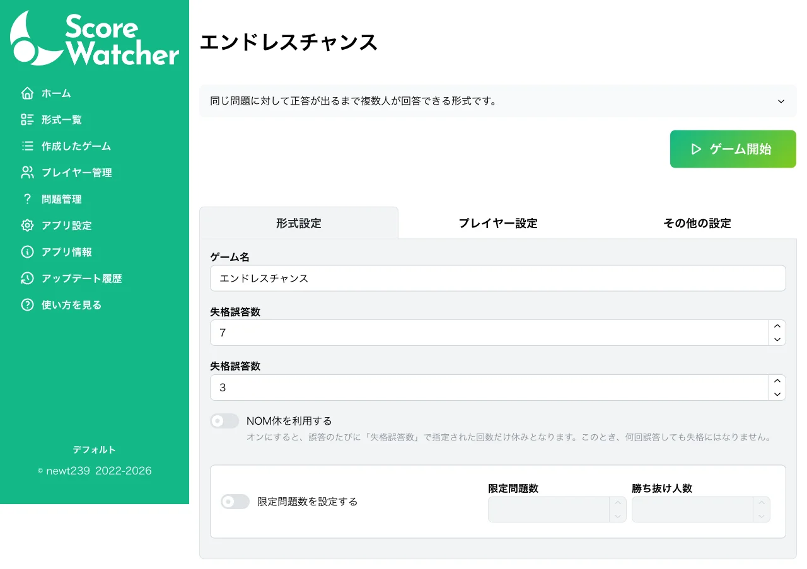
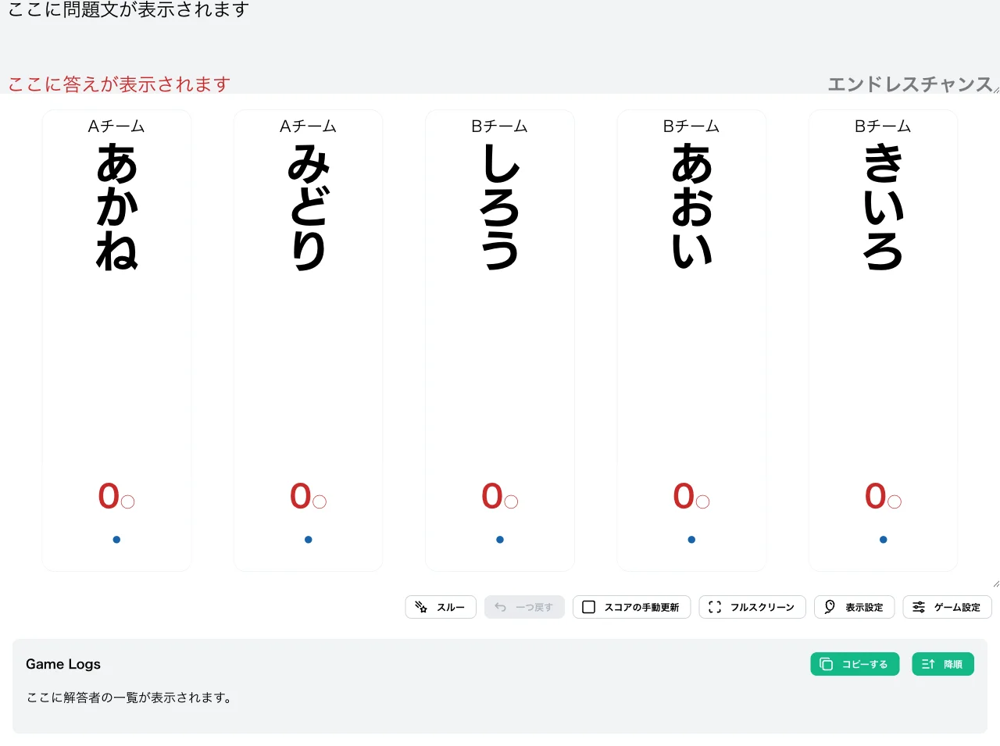
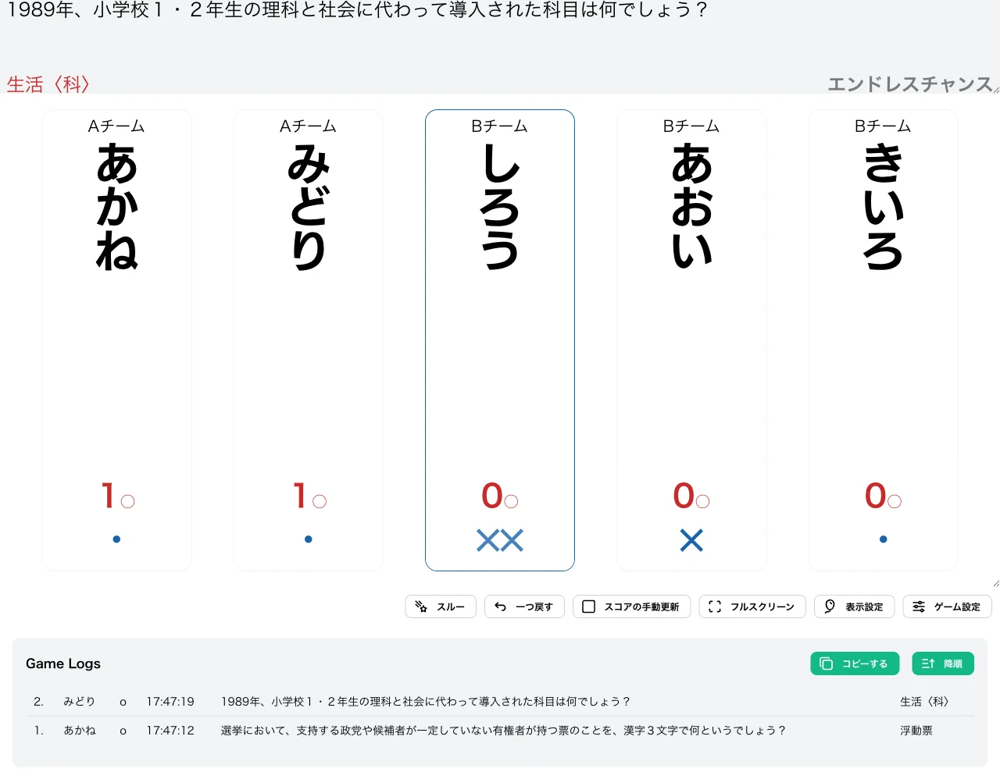
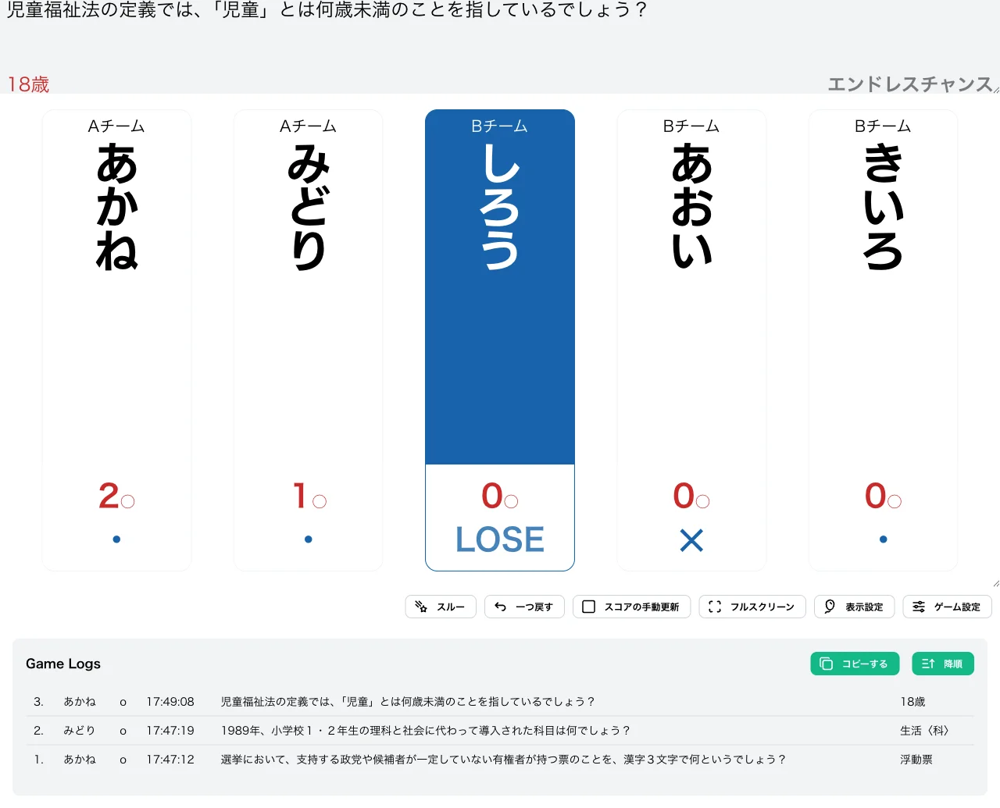
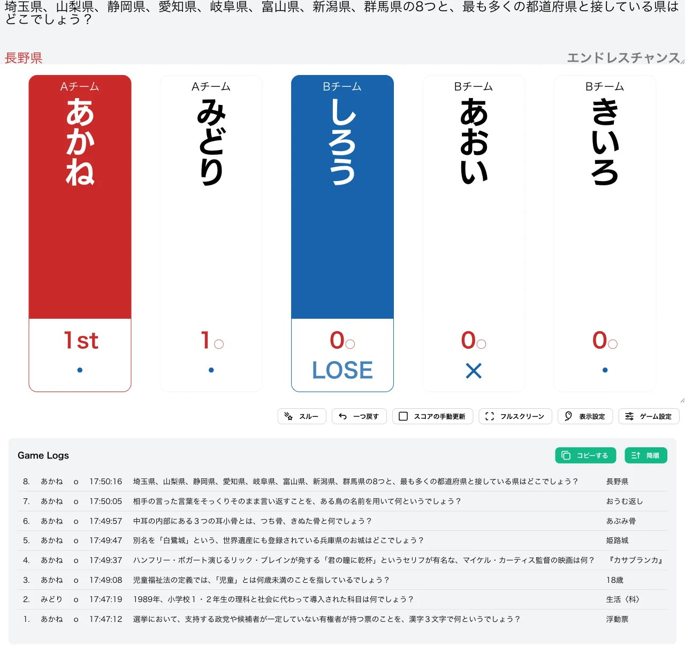

import CreateGameButton from "../../../components/CreateGameButton.astro";

同じ問題に対して、正解者が出るかスルーされるまで複数のプレイヤーが解答できる形式です。誰かが誤答してもすぐには次の問題に進まず、まだ解答していないプレイヤーに解答権が残ります。

1 つの問題で複数のプレイヤーに誤答を付けられるのが特徴で、すべてのプレイヤーが各問題に挑戦する機会を持てます。

<CreateGameButton rule="endless-chance" players={5} />

## ルール詳細

### 問題の進行

誰かが正解するか、出題者がスルーを選択するまで、同じ問題が続きます。同じ問題に対して複数のプレイヤーが誤答しても構いません。

### 勝利条件

正解数が勝ち抜け正解数に達すると勝ち抜けです。初期設定では 7 回正解で勝ち抜けとなります。

### 失格条件

誤答数が失格誤答数に達すると失格です。初期設定では 3 回誤答で失格となります。

ただし「NOM休を利用する」オプションをオンにすると、失格の代わりに誤答のたびに指定回数の休みとなり、何回誤答しても失格しません。

## 変更可能なオプション

### 勝ち抜け正解数

勝ち抜けに必要な正解数を設定できます。初期値は `7` に設定されています。

### 失格誤答数

失格となる誤答数を設定できます。初期値は `3` に設定されています。

### NOM休を利用する

初期値はオフです。オンにすると、誤答のたびに失格誤答数で指定した回数だけ休みになり、失格は無くなります。

### 限定問題数の設定

詳細は限定問題数をご確認ください。

## 操作手順

1. [形式一覧](/rules/)で「エンドレスチャンス」の「作る」をクリックします。
2. プレイヤーと問題セットを設定します（詳しくは[最初のゲームを作ろう](/guides/example/)）。
3. 得点表示画面で採点します。正解は各プレイヤーの○ボタンまたはキーボードの数字キーで記録します。誤答はキーボードショートカットではなく、**各プレイヤーの誤答ボタン（✕）のクリックで記録**します。同じ問題のうちは複数のプレイヤーに ✕ を付けることができ、もう一度クリックすると取り消せます。

## スクリーンショット

### 形式設定

ゲーム設定画面の形式設定タブです。「NOM休を利用する」スイッチ（初期状態ではオフ）と説明文が表示されています。

### 初期状態

全プレイヤーが 0 ○ の状態でゲームが始まります。

### プレイ中

同じ問題に対して複数のプレイヤーに誤答を付けられます。下の例では、同じ問題に対して「しろう」と「あおい」の 2 人が誤答しており（しろうは 2 ✕・あおいは 1 ✕）、「あかね」と「みどり」は 1 問ずつ正解しています。

### 失格

誤答数が失格誤答数に達したプレイヤーは「LOSE」と表示されます。下の例では「しろう」が 3 回目の誤答をして失格になっています。

### 勝ち抜け

正解数が勝ち抜け正解数に達したプレイヤーには順位が表示されます。下の例では「あかね」が 7 問正解して「1st」と表示されています。

## この形式で遊んでみる

下のボタンから、この形式のゲームをすぐに作成して試すことができます。

<CreateGameButton rule="endless-chance" players={5} />
