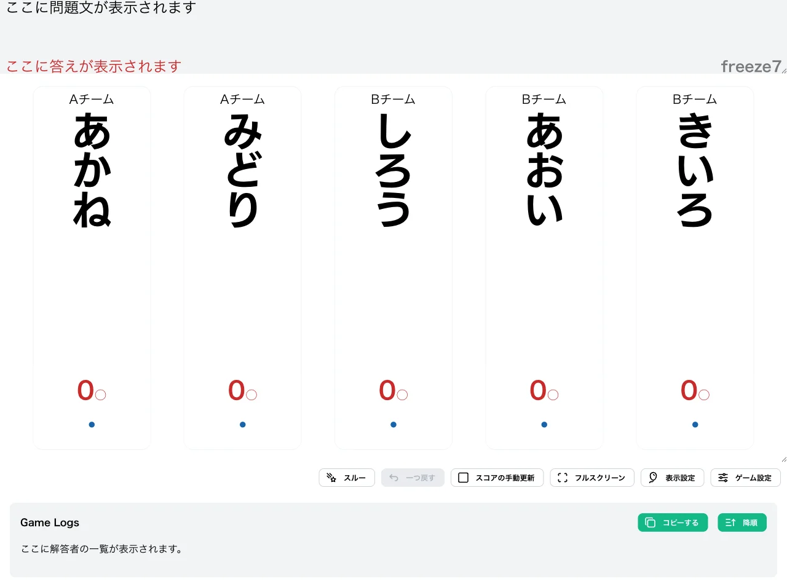
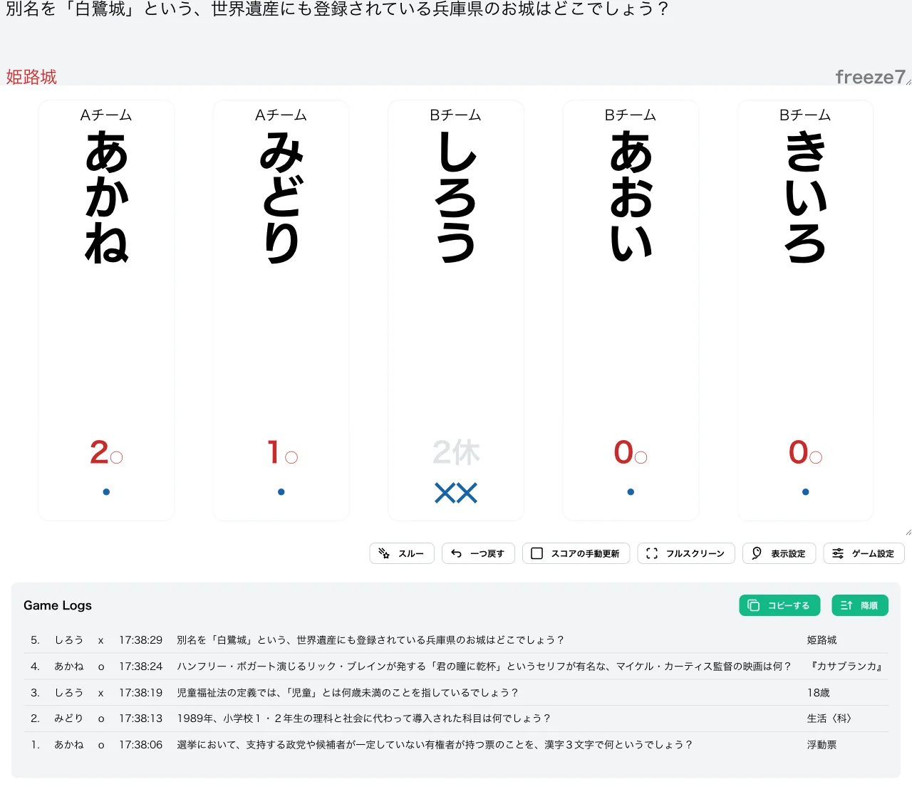
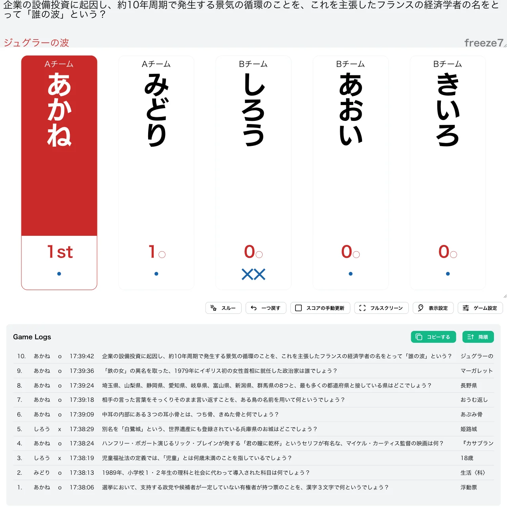

import CreateGameButton from "../../../components/CreateGameButton.astro";

X 問正解で勝ち抜け、N 回目の誤答で N 回休みとなる形式です。1 回目の誤答では 1 問休み、2 回目の誤答では 2 問休みというように、誤答を重ねるたびに休みの長さが延びていきます。

誤答時のペナルティが固定で M 問休みになる N○M休とは、この点で異なります。失格は存在しないため、休みが明ければ再び勝ち抜けを狙えます。

<CreateGameButton rule="freezex" players={5} />

## ルール詳細

### 勝利条件

正解数が勝ち抜け正解数に達すると勝ち抜けです。初期設定では 7 回正解で勝ち抜けとなります。

### 失格条件

この形式に失格はありません。ただし誤答すると、その時点での累計誤答回数に応じて休みとなり、解答権を失います。1 回目の誤答では 1 問、2 回目の誤答では 2 問、N 回目の誤答では N 問の間休みとなります。

休み中のプレイヤーはボードに残り休み問題数（例「2休」）が表示され、正解・誤答ボタンが無効化されます。

### N○M休との違い

N○M休では誤答のたびに固定で M 問休みになるのに対し、freezeX では N 回目の誤答で N 問休みと、誤答を重ねるほどペナルティが累積的に重くなります。

### ゲーム終了

設定された人数が勝ち抜けるか、全問題が終了した時点でゲームを終了します。

## 変更可能なオプション

### 勝ち抜け正解数

勝ち抜けに必要な正解数を設定できます。初期値は `7` に設定されています。

### 限定問題数の設定

詳細は限定問題数をご確認ください。

## 操作手順

1. [形式一覧](/rules/)で「freezeX」の「作る」をクリックします。
2. プレイヤーと問題セットを設定します（詳しくは[最初のゲームを作ろう](/guides/example/)）。
3. 得点表示画面で、各プレイヤーの正解／誤答ボタン（またはキーボードの数字キー／Shift＋数字キー）で採点します。

## スクリーンショット

### 初期状態

全プレイヤーが 0○ の状態でゲームが始まります。

### プレイ中

「あかね」が 2 問、「みどり」が 1 問正解しています。「しろう」は 2 回目の誤答をしたため「2休」と表示され、2 問の間解答権がありません。

### 勝ち抜け

正解数が勝ち抜け正解数に達したプレイヤーには順位が表示されます。下の例では「あかね」が 7 問正解して勝ち抜けています。「しろう」は休みが明けて 0○ の表示に戻っています。

## この形式で遊んでみる

下のボタンから、この形式のゲームをすぐに作成して試すことができます。

<CreateGameButton rule="freezex" players={5} />
