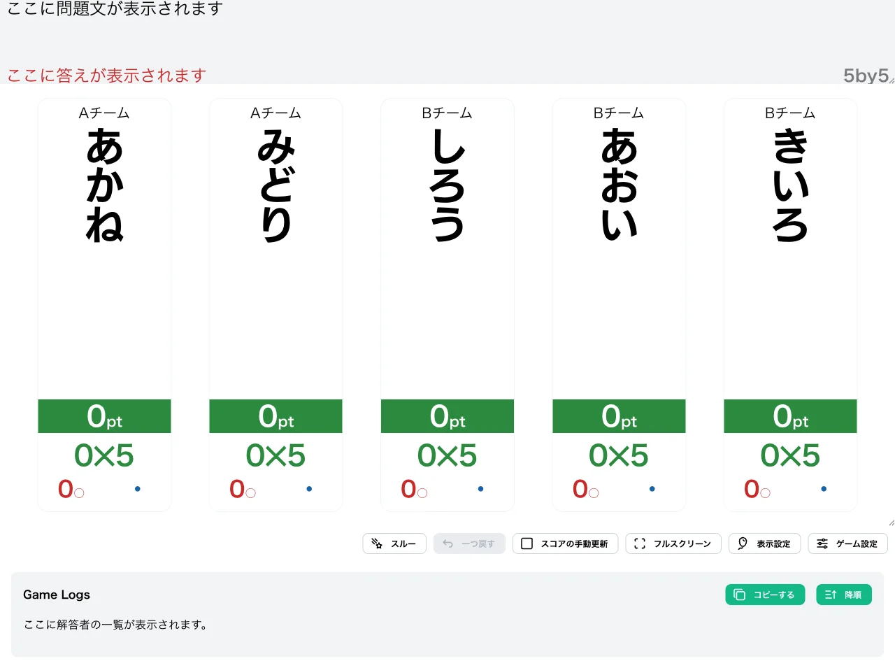
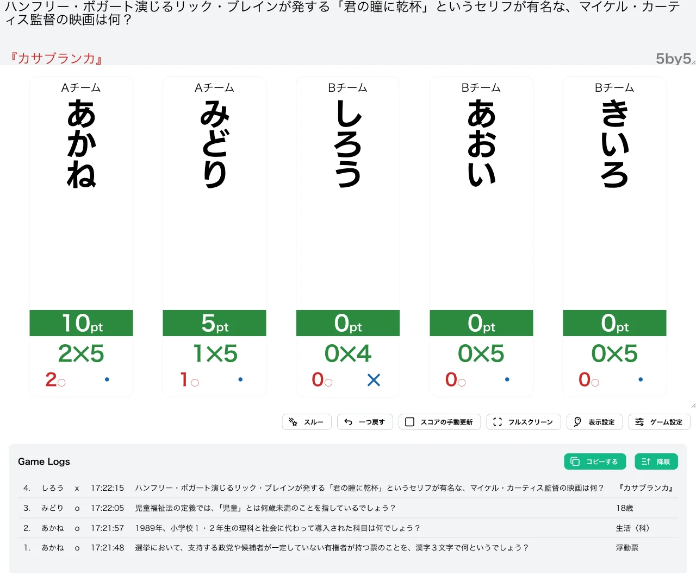
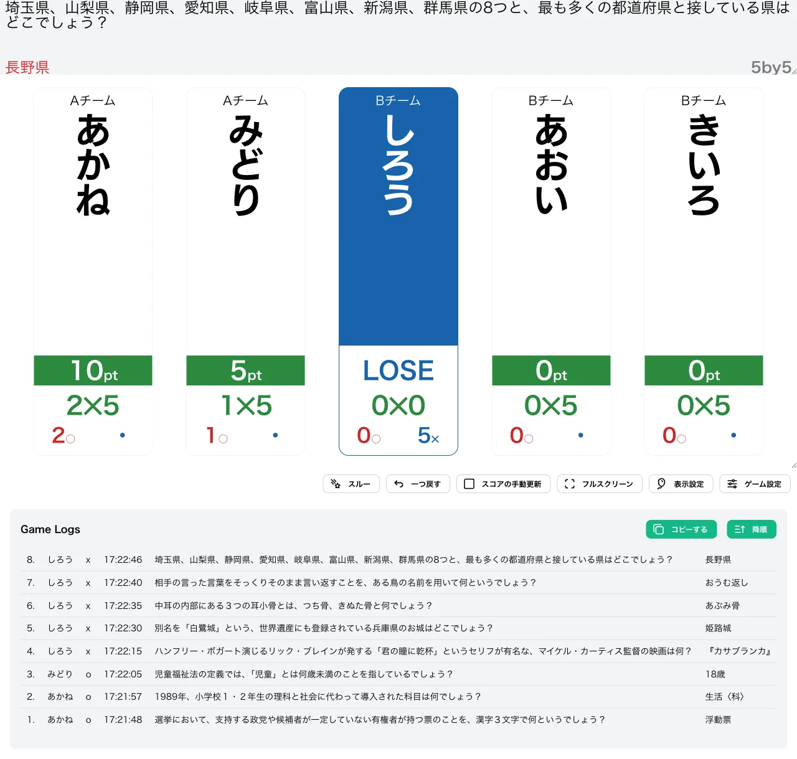
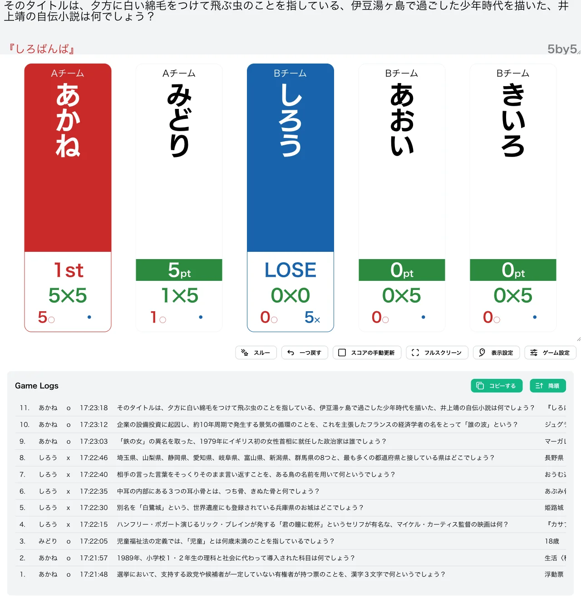

import CreateGameButton from "../../../components/CreateGameButton.astro";

正答数と誤答数の積を競う形式です。スコアは「正解数 ×（N − 誤答数）」で計算され、スコアが N²（N の 2 乗）に達すると勝ち抜けとなります。初期設定では N=5 で、25pt に到達すると勝ち抜けです。

誤答が増えるほど正解 1 問あたりのスコアの伸びが悪くなるため、積極的に解答するか慎重に構えるかの判断が問われる戦略的な形式です。

<CreateGameButton rule="nbyn" players={5} />

## ルール詳細

### 勝利条件

スコアが N² に達すると勝ち抜けです。初期設定では N=5 のため、25pt で勝ち抜けとなります。

### 失格条件

誤答数が N 回に達すると失格です。初期設定では 5 回誤答で失格となります。このとき係数（N − 誤答数）が 0 になるため、スコアも 0pt になります。

### スコア計算

スコアは次の式で計算されます。

```
スコア = 正解数 ×（N − 誤答数）
```

正解すると正解数が 1 増え、誤答すると係数（N − 誤答数）が 1 減ります。得点表示画面のボードには、スコアとあわせて「正解数 ×（N − 誤答数）」の内訳も表示されます。

#### 計算例

N=5 の設定で、次のように採点が進んだ場合のスコア推移です。

| 操作 | 計算 | スコア |
| --- | --- | --- |
| 開始 | 0 × 5 | 0pt |
| 正解 | 1 × 5 | 5pt |
| 正解 | 2 × 5 | 10pt |
| 誤答（1回目） | 2 × 4 | 8pt |
| 正解 | 3 × 4 | 12pt |
| 誤答（2回目） | 3 × 3 | 9pt |

### ゲーム終了

設定された人数が勝ち抜けるか、全問題が終了した時点でゲームを終了します。

## 変更可能なオプション

### N

勝ち抜けポイントの基準となる値を設定できます。スコアが N² に達すると勝ち抜けです。初期値は `5` に設定されています。

### 失格誤答数

失格となる誤答数を設定できます。初期値は `5` に設定されています。

### 限定問題数の設定

詳細は限定問題数をご確認ください。

## 操作手順

1. [形式一覧](/rules/)で「NbyN」の「作る」をクリックします。
2. プレイヤーと問題セットを設定します（詳しくは[最初のゲームを作ろう](/guides/example/)）。
3. 得点表示画面で、各プレイヤーの正解／誤答ボタン（またはキーボードの数字キー／Shift＋数字キー）で採点します。

## スクリーンショット

### 初期状態

全プレイヤーが 0pt（0 × 5）の状態でゲームが始まります。



### プレイ中

正解でスコアが伸び、誤答すると係数が減ります。下の例では「あかね」が 2 問正解で 10pt（2 × 5）、「みどり」が 1 問正解で 5pt（1 × 5）、「しろう」は 1 回誤答したため係数が 4 に減り 0pt（0 × 4）となっています。



### 失格

誤答数が失格誤答数に達したプレイヤーは「LOSE」と表示されます。下の例では「しろう」が 5 回誤答（0 × 0・5✕）して失格になっています。



### 勝ち抜け

スコアが N² に達したプレイヤーには順位が表示されます。下の例では「あかね」が 5 問正解して 25pt（5 × 5）に到達し、「1st」と表示されています。



## この形式で遊んでみる

下のボタンから、この形式のゲームをすぐに作成して試すことができます。

<CreateGameButton rule="nbyn" players={5} />
