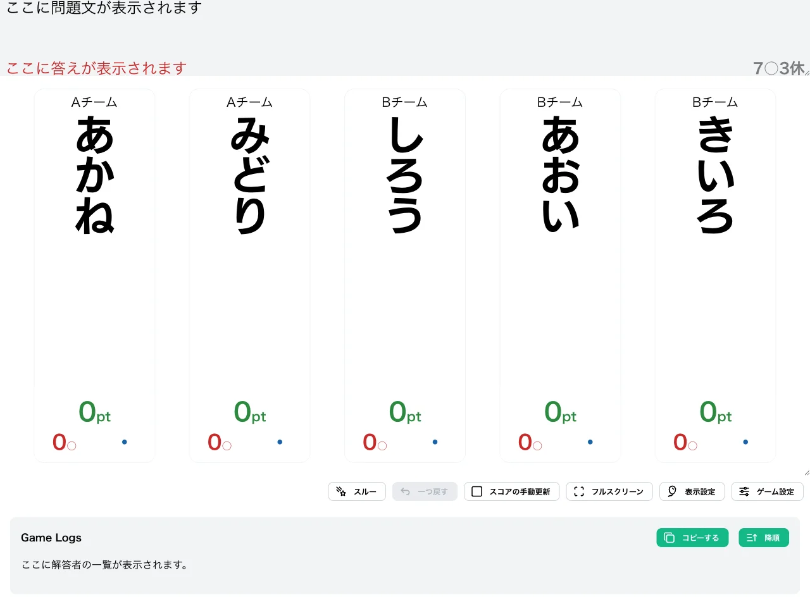
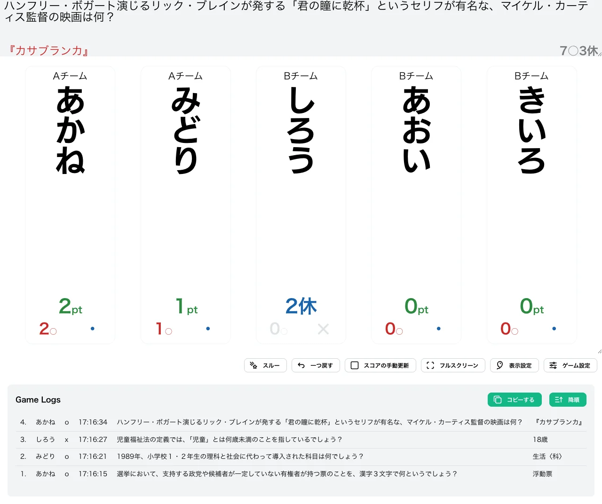
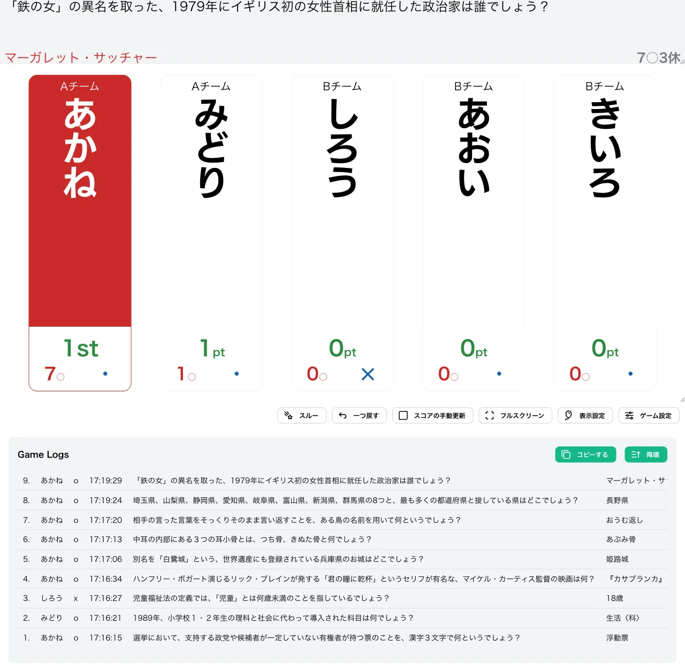

import CreateGameButton from "../../../components/CreateGameButton.astro";

N 回正解で勝ち抜けを目指す形式です。誤答しても失格にはならず、代わりに M 問の間「休み」となって解答権を失います。

誤答による失格がないため、すべてのプレイヤーが最後まで競技に参加できるのが特徴です。休みは一時的なペナルティで、指定された問題数が経過すると自動的に解答権が回復します。

<CreateGameButton rule="nomr" players={5} />

## ルール詳細

### 勝利条件

正解数が勝ち抜け正解数に達すると勝ち抜けです。初期設定では 7 回正解で勝ち抜けとなります。

### 失格条件

この形式に失格はありません。誤答すると、その時点から M 問（初期設定では 3 問）の間「休み」状態になり、解答権を失います。休み中はボードに残り休み問題数（例：「2休」）が表示され、正解・誤答ボタンが無効化されます。休み問題数が経過すると自動的に解答権が回復します。

### スコア計算

正解すると正解数が 1 カウントされます。誤答は誤答数としてカウントされますが、スコアには影響しません。

### ゲーム終了

設定された人数が勝ち抜けるか、全問題が終了した時点でゲームを終了します。

## 変更可能なオプション

### 勝ち抜け正解数

勝ち抜けに必要な正解数を設定できます。初期値は `7` に設定されています。

### 休み問題数

誤答したときに休みとなる問題数を設定できます。初期値は `3` に設定されています。

### 限定問題数の設定

詳細は限定問題数をご確認ください。

## 操作手順

1. [形式一覧](/rules/)で「N○M休」の「作る」をクリックします。
2. プレイヤーと問題セットを設定します（詳しくは[最初のゲームを作ろう](/guides/example/)）。
3. 得点表示画面で、各プレイヤーの正解／誤答ボタン（またはキーボードの数字キー／Shift＋数字キー）で採点します。

## スクリーンショット

### 初期状態

全プレイヤーが 0pt の状態でゲームが始まります。

### プレイ中

正解すると正解数が加算されます。下の例では「あかね」が 2 問正解（2pt）、「みどり」が 1 問正解（1pt）しています。「しろう」は誤答したため「2休」と青色で表示され、正解・誤答ボタンがグレーアウトして解答権がない状態です。

### 勝ち抜け

正解数が勝ち抜け正解数に達したプレイヤーには順位が表示されます。下の例では「あかね」が 7 問正解して「1st」と表示されています。「しろう」は休み明けで解答権が回復し、0pt 表示に戻っています。

## この形式で遊んでみる

下のボタンから、この形式のゲームをすぐに作成して試すことができます。

<CreateGameButton rule="nomr" players={5} />
