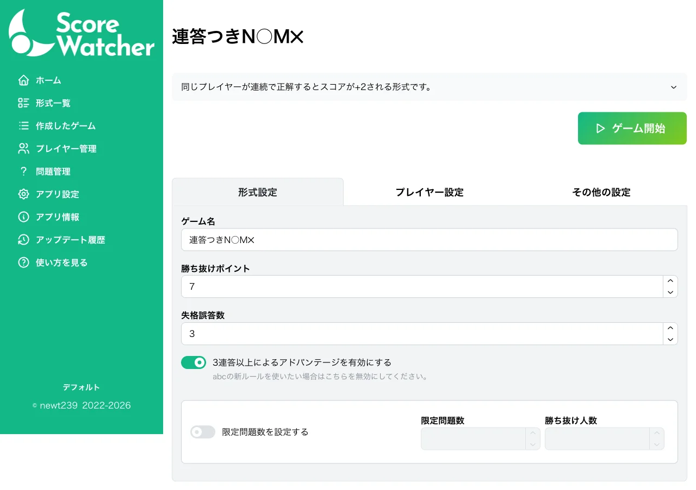
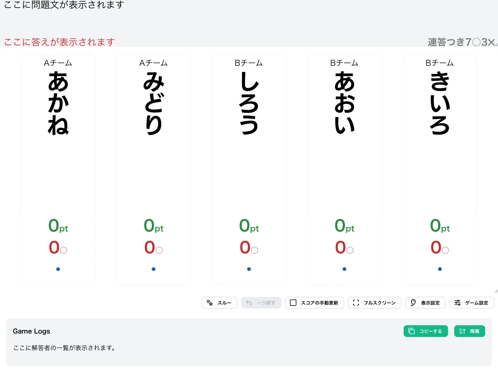
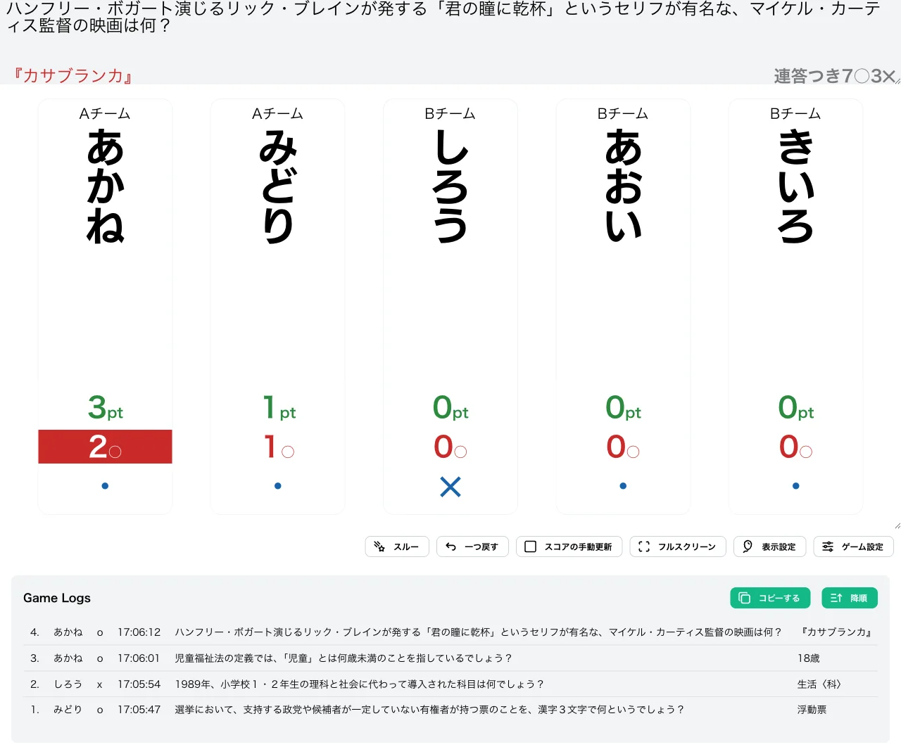
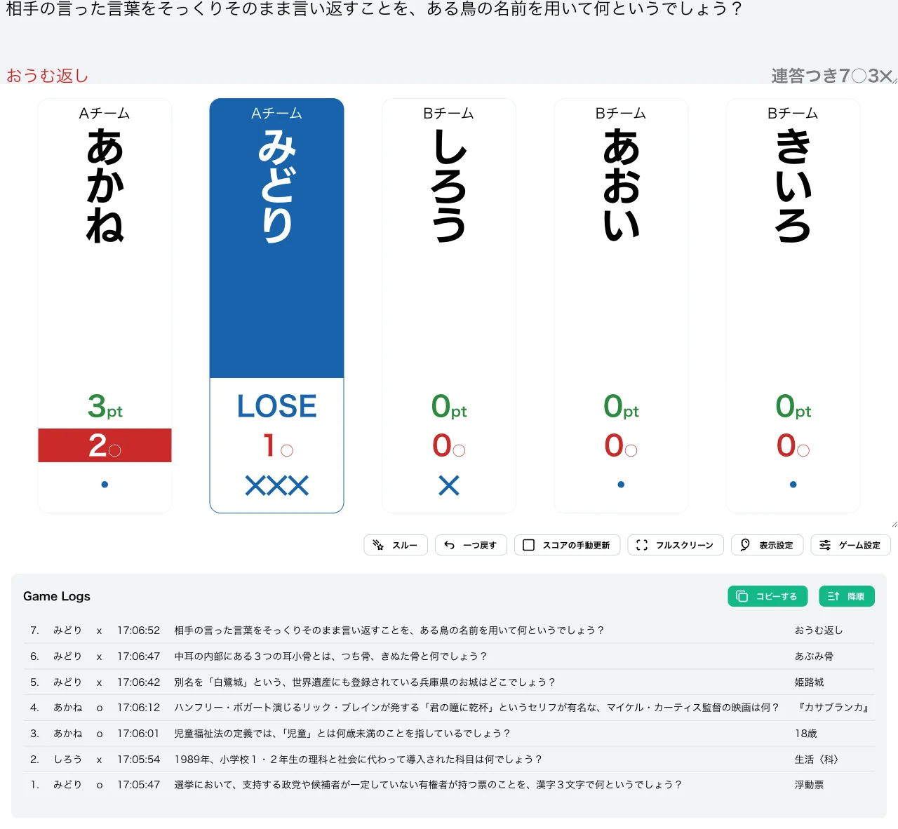
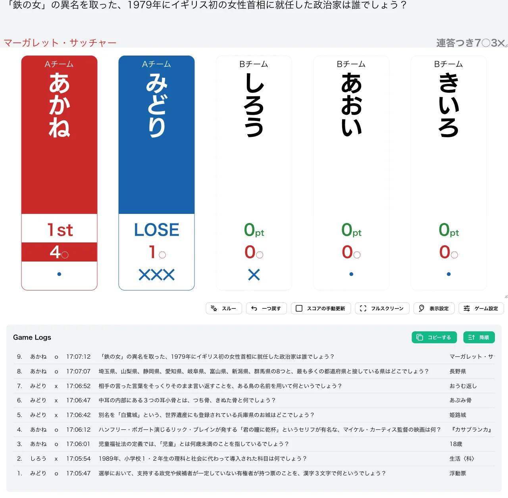

import CreateGameButton from "../../../components/CreateGameButton.astro";

基本的な N○M✕ 形式に、連続正解によるアドバンテージを追加した形式です。前の問題で正解したプレイヤーが続けて正解すると、通常の 2 倍のポイントを獲得できるため、連答を狙う積極的な解答が有効になります。

abc（クイズ大会）の 2nd Round で採用されている形式です。

<CreateGameButton rule="nomx-ad" players={5} />

## ルール詳細

### 勝利条件

スコアが勝ち抜けポイントに達すると勝ち抜けです。初期設定では 7pt で勝ち抜けとなります。

### 失格条件

M 回誤答すると失格です。初期設定では 3 回誤答で失格となり、失格したプレイヤーは以降の問題に参加できません。

### スコア計算

- **通常時**：正解するとスコアに 1pt が加算されます。
- **連答時**：前の問題でも自分が正解していた場合（アドバンテージ状態）、正解するとスコアに 2pt が加算されます。
- **連答状態の解除**：誤答するか、他のプレイヤーが正解すると、アドバンテージ状態は解除されます。

#### 計算例

「あかね」のスコアが次のように推移する例です。

| 問題 | 出来事 | 計算 | あかねのスコア |
| --- | --- | --- | --- |
| 1 | あかねが正解 | +1 | 1pt |
| 2 | あかねが正解（連答） | +2 | 3pt |
| 3 | あかねが正解（連答継続） | +2 | 5pt |
| 4 | みどりが正解（あかねの連答は解除） | — | 5pt |
| 5 | あかねが正解（通常） | +1 | 6pt |

### ゲーム終了

設定された人数が勝ち抜けるか、全問題が終了した時点でゲームを終了します。

## 変更可能なオプション

### 勝ち抜けポイント

勝ち抜けに必要なスコアを設定できます。初期値は `7` に設定されています。

### 失格誤答数

失格となる誤答数を設定できます。初期値は `3` に設定されています。

### 3連答以上によるアドバンテージを有効にする

初期値は ON です。ON の場合、連続正解している限りアドバンテージ（+2pt）が継続します。OFF にすると 2 連答目までしか +2pt にならず、3 連答目以降は通常の +1pt となります（abc の新ルール相当）。

### 限定問題数の設定

詳細は限定問題数をご確認ください。

## 操作手順

1. [形式一覧](/rules/)で「連答つきN○M✕」の「作る」をクリックします。
2. プレイヤーと問題セットを設定します（詳しくは[最初のゲームを作ろう](/guides/example/)）。
3. 得点表示画面で、各プレイヤーの正解／誤答ボタン（またはキーボードの数字キー／Shift＋数字キー）で採点します。

## スクリーンショット

### ゲーム設定画面

形式設定タブで、勝ち抜けポイント・失格誤答数・「3連答以上によるアドバンテージを有効にする」スイッチを設定できます。

### 初期状態

全プレイヤーが 0pt の状態でゲームが始まります。

### プレイ中

下の例では「みどり」が 1 問正解（1pt）、「しろう」が 1 回誤答したあと、「あかね」が 2 問連続で正解し 1 + 2 = 3pt となっています。連答状態のプレイヤーは正解数の表示が赤くハイライトされます。

### 失格

誤答数が失格誤答数に達したプレイヤーは「LOSE」と表示され、以降採点できなくなります。下の例では「みどり」が 3 回誤答して失格になっています。

### 勝ち抜け

スコアが勝ち抜けポイントに達したプレイヤーには順位が表示されます。下の例では「あかね」が連答を重ねて 7pt に到達し、勝ち抜けています。

## この形式で遊んでみる

下のボタンから、この形式のゲームをすぐに作成して試すことができます。

<CreateGameButton rule="nomx-ad" players={5} />
