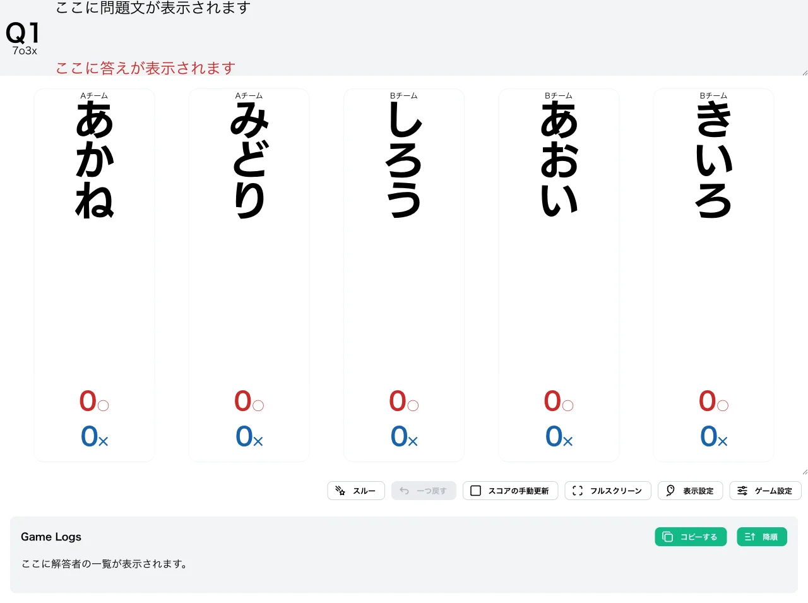
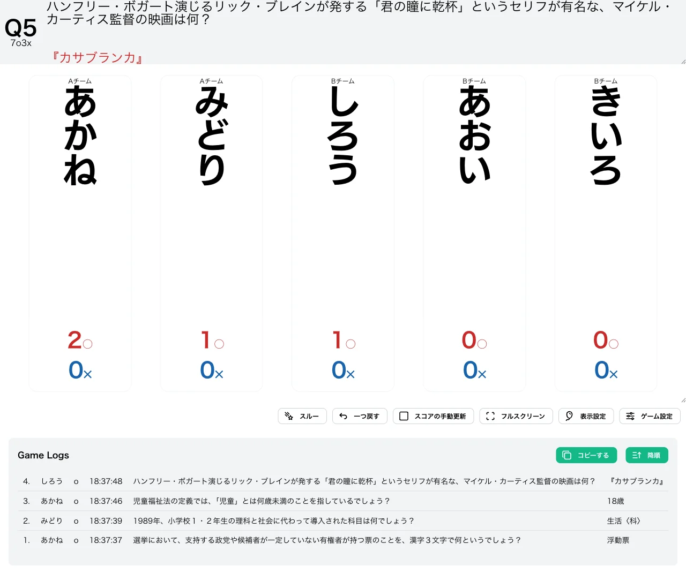
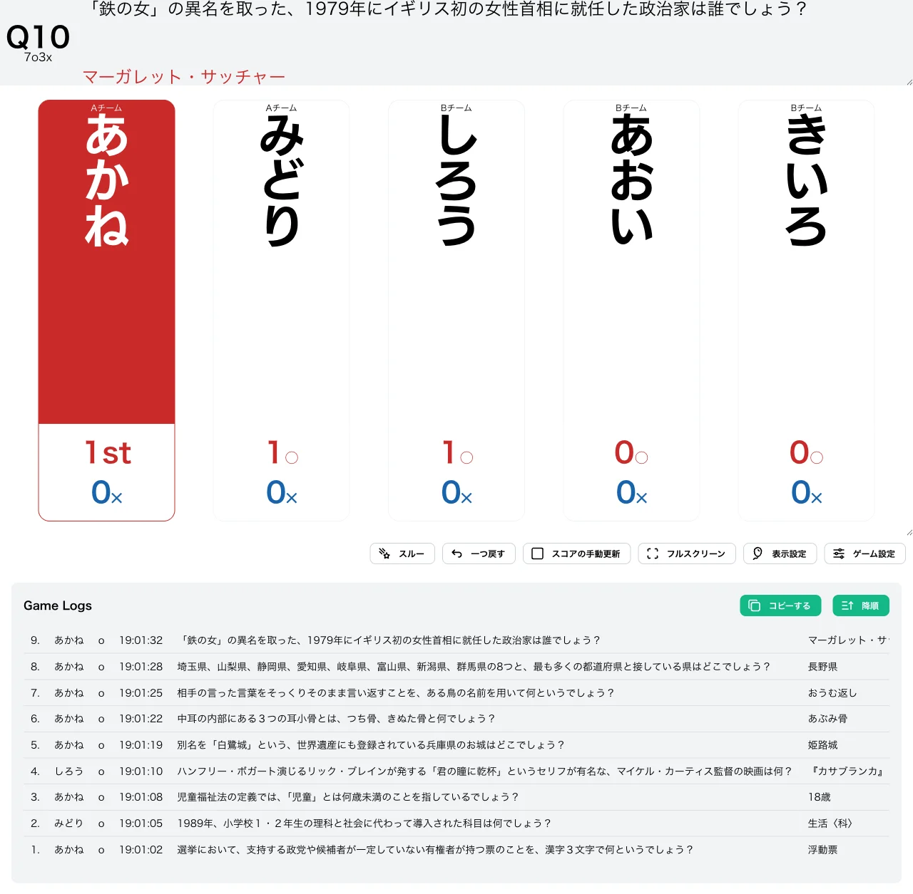
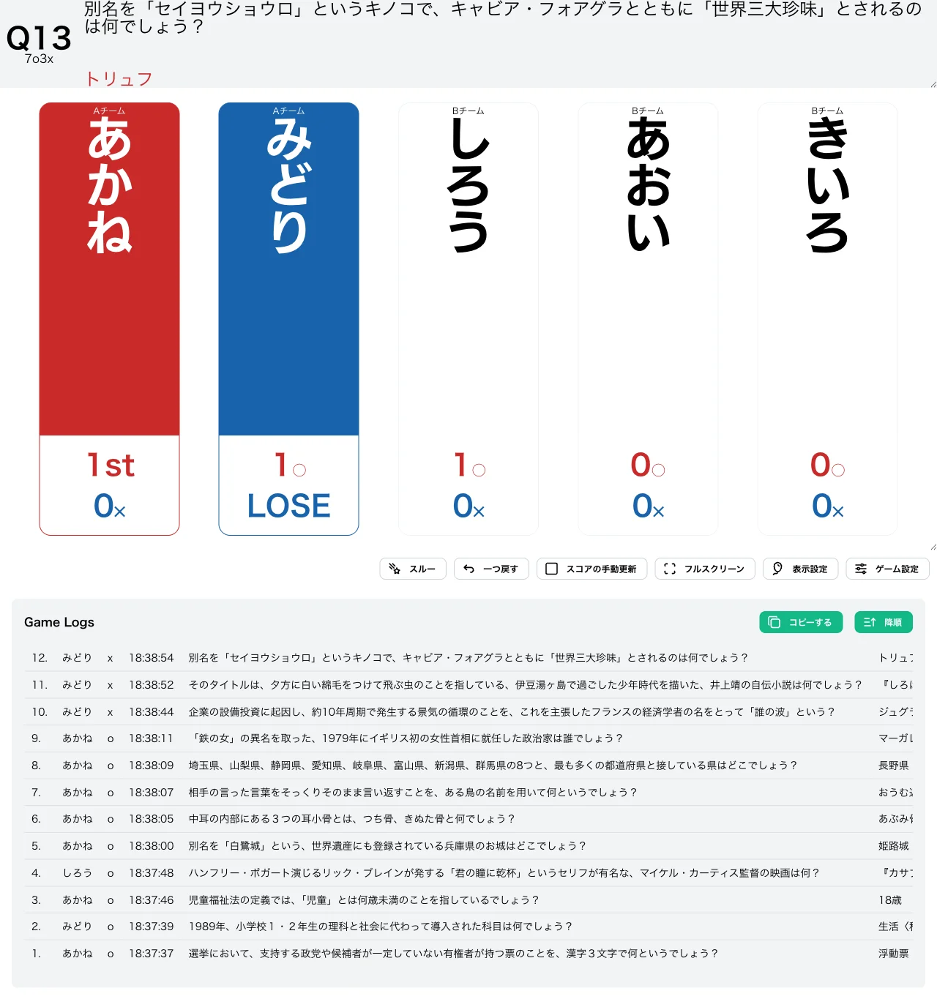

import CreateGameButton from "../../../components/CreateGameButton.astro";

N 回正解で勝ち抜け、M 回誤答で失格の形式です。代表的なものに「ナナマルサンバツ（7○3✕）」があり、競技クイズで最も基本的な形式の1つです。

正解を重ねて勝ち抜けを目指す一方、誤答が一定数に達すると失格となるため、解答するかどうかの判断に緊張感が生まれます。

<CreateGameButton rule="nomx" players={5} />

## ルール詳細

### 勝利条件

N 回正解すると勝ち抜けです。初期設定では 7 回正解で勝ち抜けとなります。

### 失格条件

M 回誤答すると失格です。初期設定では 3 回誤答で失格となり、失格したプレイヤーは以降の問題に参加できません。

### ゲーム終了

設定された人数が勝ち抜けるか、全問題が終了した時点でゲームを終了します。

## 変更可能なオプション

### 勝ち抜け正解数

勝ち抜けに必要な正解数を設定できます。初期値は `7` に設定されています。

### 失格誤答数

失格となる誤答数を設定できます。初期値は `3` に設定されています。

### 限定問題数の設定

詳細は限定問題数をご確認ください。

## スクリーンショット

### 初期状態

### プレイ中

### 勝ち抜け

正解数が勝ち抜け正解数に達したプレイヤーには順位が表示されます。

### 失格

誤答数が失格誤答数に達したプレイヤーは「LOSE」と表示され、以降採点できなくなります。

## この形式で遊んでみる

下のボタンから、この形式のゲームをすぐに作成して試すことができます。

<CreateGameButton rule="nomx" players={5} />
