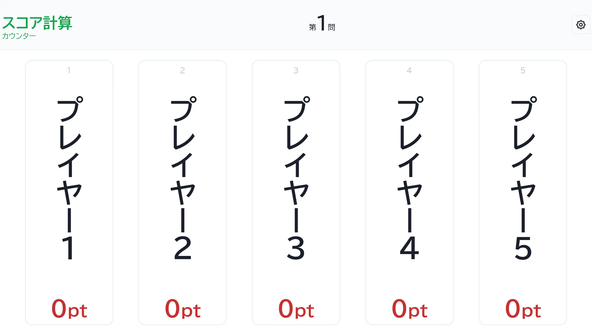

import CreateGameButton from "../../../components/CreateGameButton.astro";

スコアの計算を行います。

<CreateGameButton rule="normal" players={5} />

## スクリーンショット

### 初期状態

## この形式で遊んでみる

下のボタンから、この形式のゲームをすぐに作成して試すことができます。

<CreateGameButton rule="normal" players={5} />
