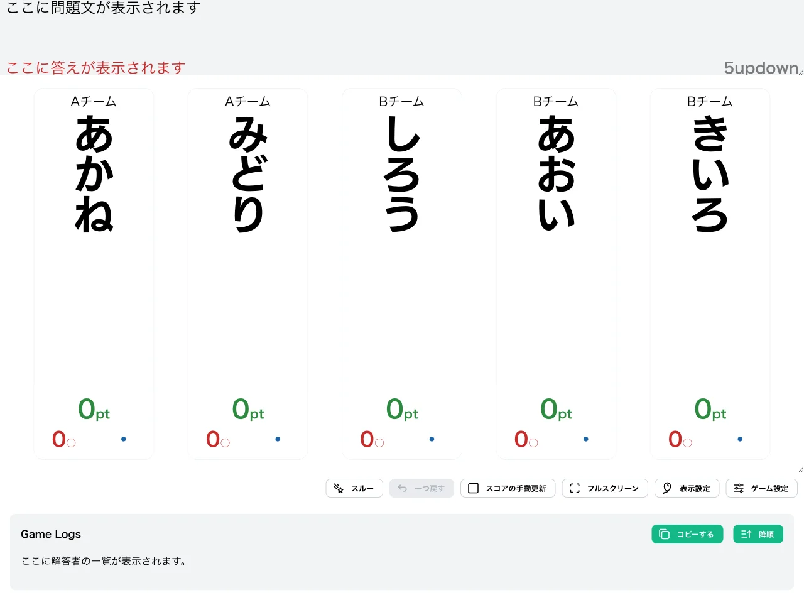
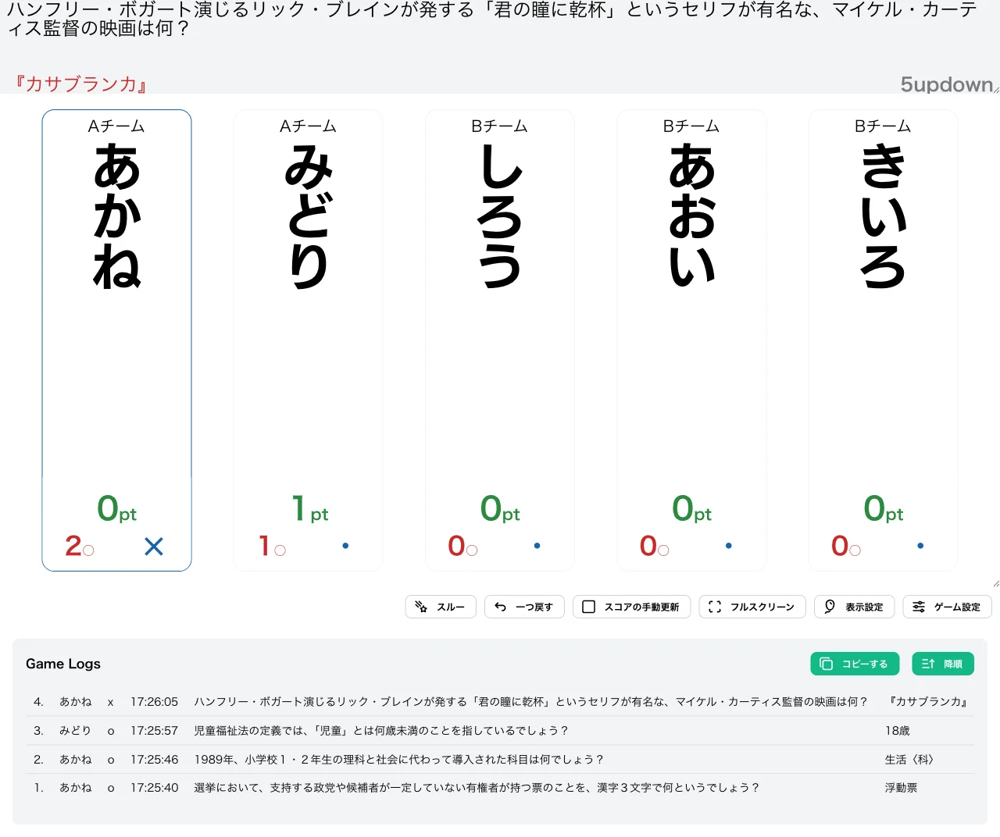
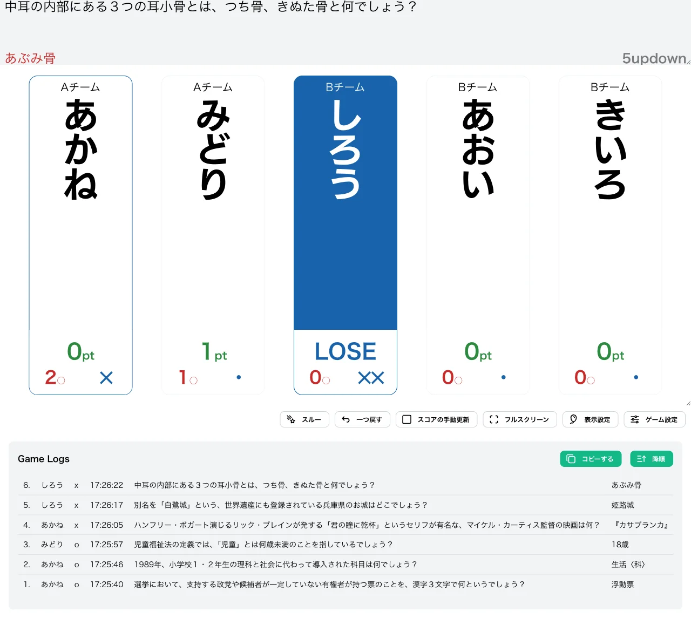
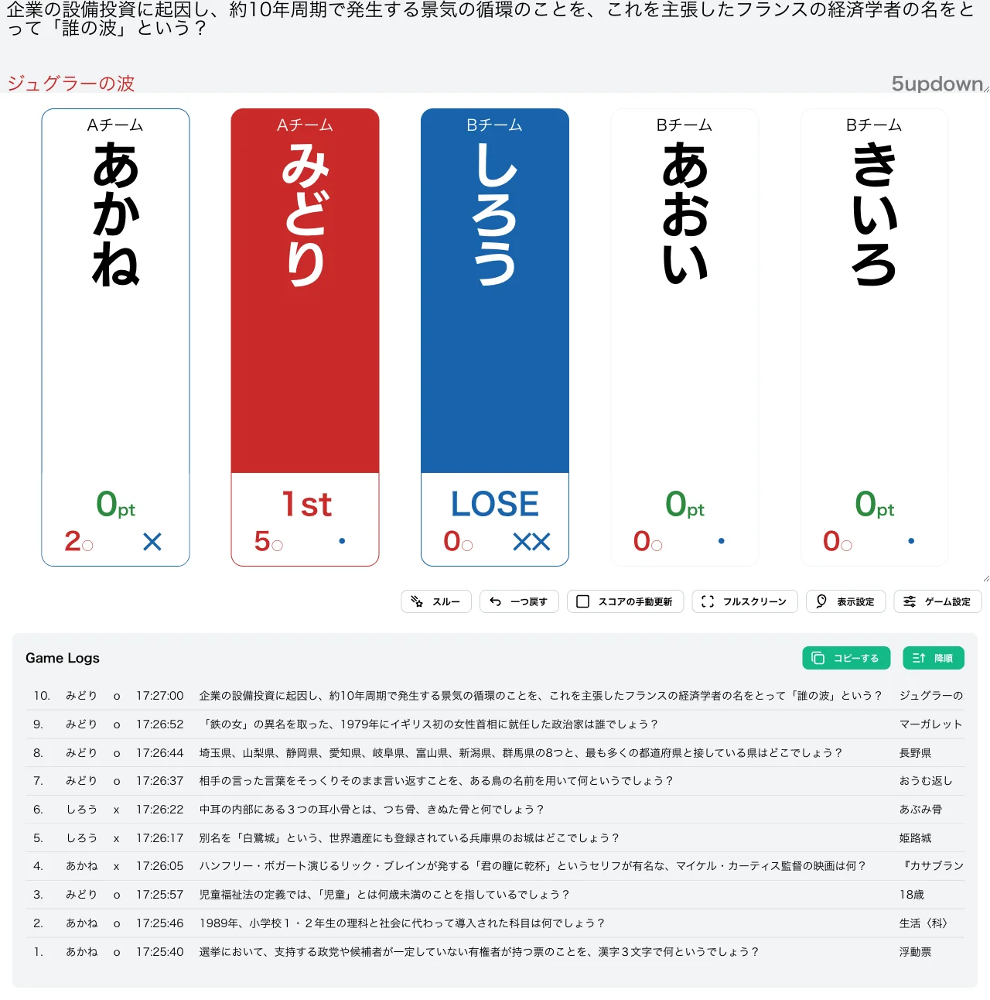

import CreateGameButton from "../../../components/CreateGameButton.astro";

N 回正解で勝ち抜けとなりますが、途中で一度でも誤答するとスコアが 0 にリセットされる形式です。正解するごとにスコアが 1 ずつ増えていく一方、誤答すると何点持っていても必ず 0pt に戻ってしまいます。

それまでの正解の積み重ねが 1 回の誤答ですべて無駄になるため、誤答に非常に厳しい形式です。スコアが高くなるほど誤答のリスクが重くなり、解答するかどうかの判断に強い緊張感が生まれます。

<CreateGameButton rule="nupdown" players={5} />

## ルール詳細

### 勝利条件

スコアが勝ち抜けポイントに達すると勝ち抜けです。初期設定では 5pt で勝ち抜けとなります。

### 失格条件

誤答数が失格誤答数に達すると失格です。初期設定では 2 回誤答で失格となり、失格したプレイヤーは以降の問題に参加できません。

### スコア計算

- **正解時**：スコアに 1pt が加算されます。
- **誤答時**：スコアが 0 にリセットされます（何点あっても必ず 0pt に戻ります）。

#### 計算例

次のように採点が進んだ場合のスコア推移です。

| 操作 | 計算 | スコア |
| --- | --- | --- |
| 開始 | — | 0pt |
| 正解 | 0 + 1 | 1pt |
| 正解 | 1 + 1 | 2pt |
| 誤答（1回目） | 0 にリセット | 0pt |
| 正解 | 0 + 1 | 1pt |
| 正解 | 1 + 1 | 2pt |

### ゲーム終了

設定された人数が勝ち抜けるか、全問題が終了した時点でゲームを終了します。

## 変更可能なオプション

### 勝ち抜けポイント

勝ち抜けに必要なスコアを設定できます。初期値は `5` に設定されています。

### 失格誤答数

失格となる誤答数を設定できます。初期値は `2` に設定されています。

### 限定問題数の設定

詳細は限定問題数をご確認ください。

## 操作手順

1. [形式一覧](/rules/)で「Nupdown」の「作る」をクリックします。
2. プレイヤーと問題セットを設定します（詳しくは[最初のゲームを作ろう](/guides/example/)）。
3. 得点表示画面で、各プレイヤーの正解／誤答ボタン（またはキーボードの数字キー／Shift＋数字キー）で採点します。

## スクリーンショット

### 初期状態

全プレイヤーが 0pt の状態でゲームが始まります。

### プレイ中

誤答すると、それまで積み上げたスコアが 0pt にリセットされます。下の例では「あかね」が 2 問正解で 2pt まで積み上げたあとに誤答し、スコアが 0pt に戻っています（2○1✕。失格リーチのため枠が青く表示されています）。「みどり」は 1 問正解で 1pt です。

### 失格

誤答数が失格誤答数に達したプレイヤーは「LOSE」と表示され、以降採点できなくなります。下の例では「しろう」が 2 回誤答して失格になっています。

### 勝ち抜け

スコアが勝ち抜けポイントに達したプレイヤーには順位が表示されます。下の例では「みどり」が 5 問正解で 5pt に到達し「1st」と表示されています。「しろう」は失格、「あかね」は誤答によるリセット後 0pt のままです。

## この形式で遊んでみる

下のボタンから、この形式のゲームをすぐに作成して試すことができます。

<CreateGameButton rule="nupdown" players={5} />
