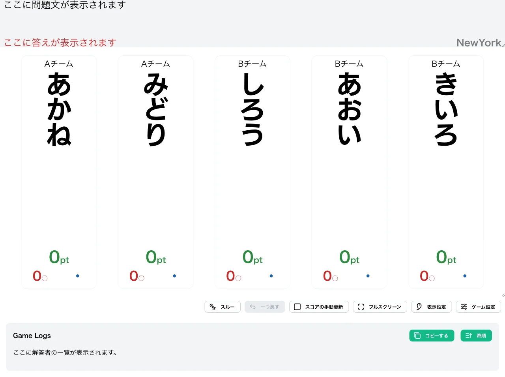
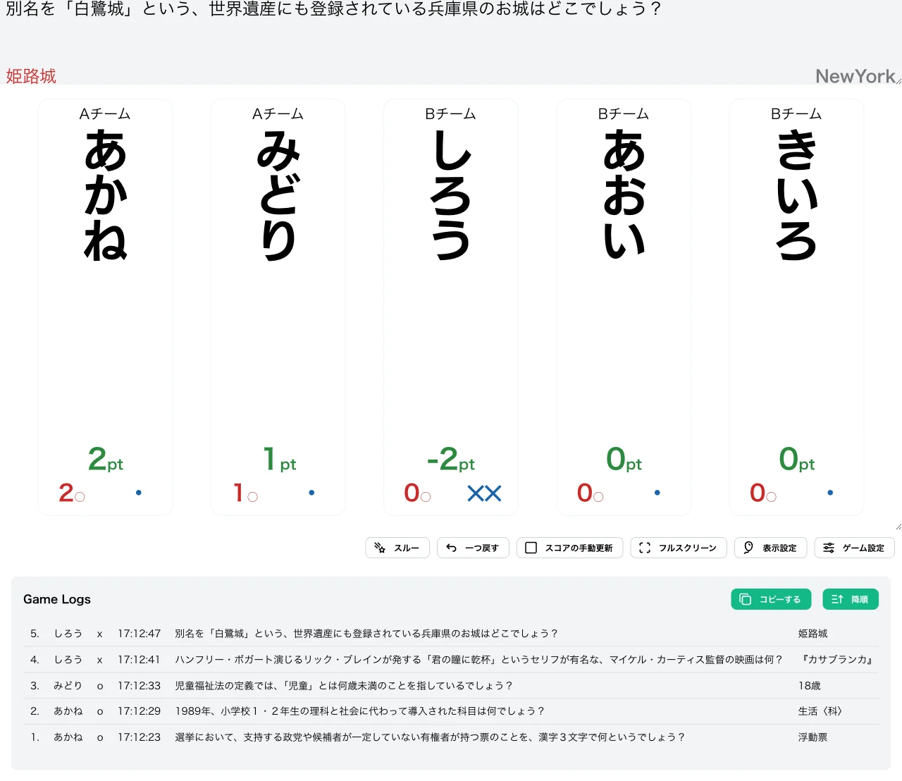
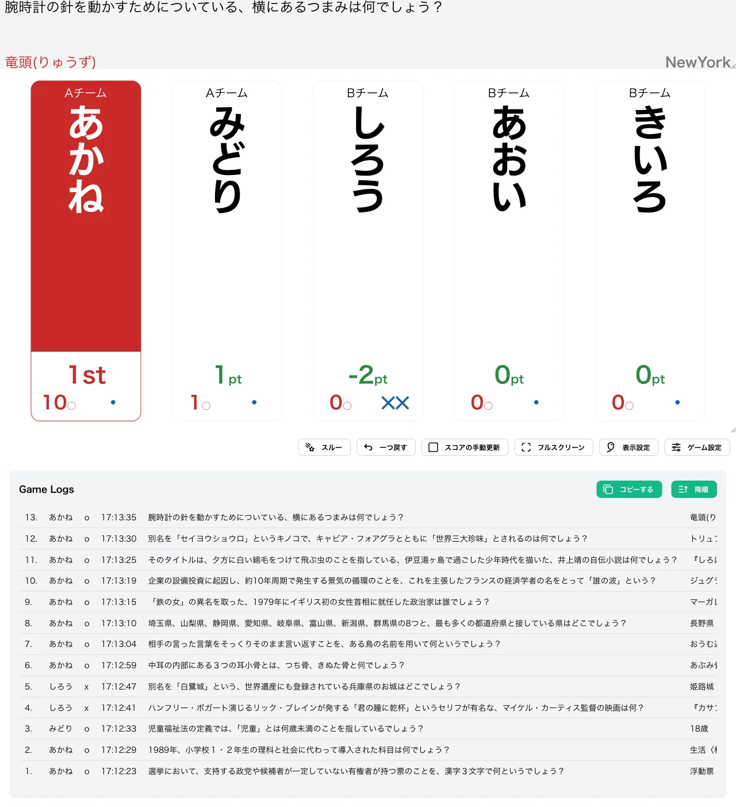

import CreateGameButton from "../../../components/CreateGameButton.astro";

正答で +1、誤答で -1 され、勝ち抜けポイントへの到達を目指す形式です。各プレイヤーは 0pt からスタートし、正解と誤答でスコアが上下に変動します。

1 回の誤答でスコアが下がるため逆転要素が強く、最後まで結果が読めない緊迫感のある形式です。

<CreateGameButton rule="ny" players={5} />

## ルール詳細

### 勝利条件

スコアが勝ち抜けポイントに達すると勝ち抜けです。初期設定では 10pt で勝ち抜けとなります。

### 失格条件

初期設定では失格はありません。誤答してもスコアがマイナスになるだけで、最後まで競技に参加できます。

### スコア計算

- **初期スコア**：各プレイヤー 0pt からスタートします。
- **正解時**：スコアに 1pt が加算されます。
- **誤答時**：スコアから 1pt が減算されます。誤答が続くとスコアはマイナスの値も取り得ます。

#### 計算例

0pt から始めて、次のように採点が進んだ場合のスコア推移です。

| 操作 | 計算 | スコア |
| --- | --- | --- |
| 開始 | — | 0pt |
| 正解 | 0 + 1 | 1pt |
| 正解 | 1 + 1 | 2pt |
| 誤答 | 2 - 1 | 1pt |
| 誤答 | 1 - 1 | 0pt |
| 誤答 | 0 - 1 | -1pt |

### ゲーム終了

設定された人数が勝ち抜けるか、全問題が終了した時点でゲームを終了します。

## 変更可能なオプション

### 勝ち抜けポイント

勝ち抜けに必要なスコアを設定できます。初期値は `10` に設定されています。

### 限定問題数の設定

詳細は限定問題数をご確認ください。

## 操作手順

1. [形式一覧](/rules/)で「NewYork」の「作る」をクリックします。
2. プレイヤーと問題セットを設定します（詳しくは[最初のゲームを作ろう](/guides/example/)）。
3. 得点表示画面で、各プレイヤーの正解／誤答ボタン（またはキーボードの数字キー／Shift＋数字キー）で採点します。

## スクリーンショット

### 初期状態

全プレイヤーが 0pt の状態でゲームが始まります。

### プレイ中

正解でスコアが +1、誤答で -1 されます。下の例では「あかね」が 2 問正解で 2pt、「みどり」が 1 問正解で 1pt となり、「しろう」は 2 回誤答して -2pt とマイナスのスコアになっています。

### 勝ち抜け

スコアが勝ち抜けポイントに達したプレイヤーには順位が表示されます。下の例では「あかね」が 10pt に到達し、「1st」と表示されています。

## この形式で遊んでみる

下のボタンから、この形式のゲームをすぐに作成して試すことができます。

<CreateGameButton rule="ny" players={5} />
