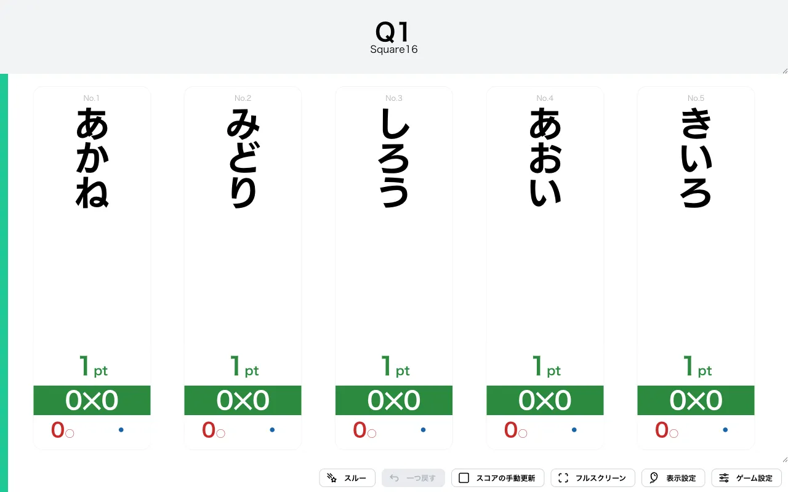
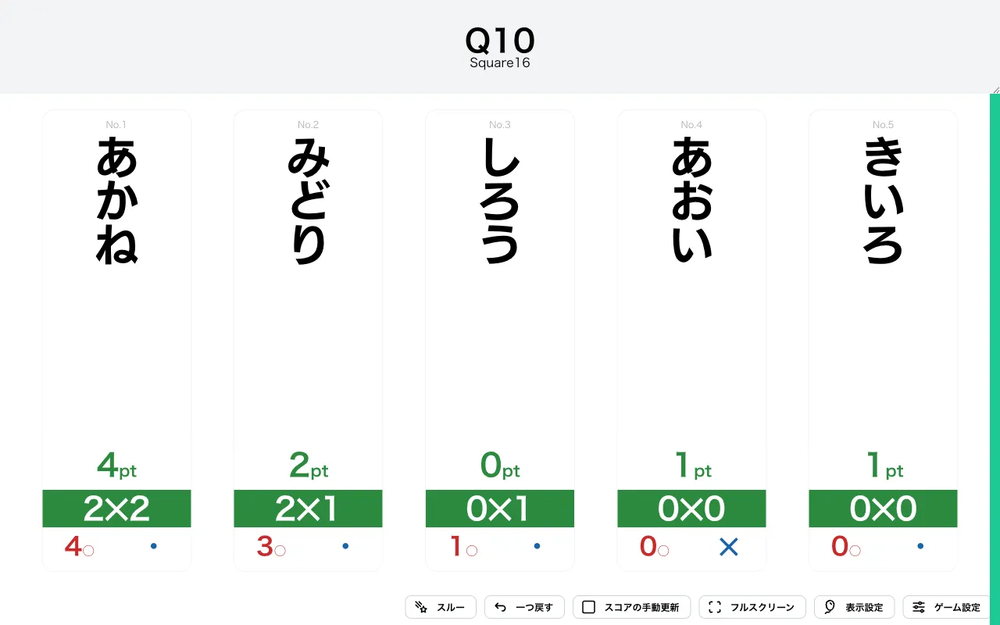
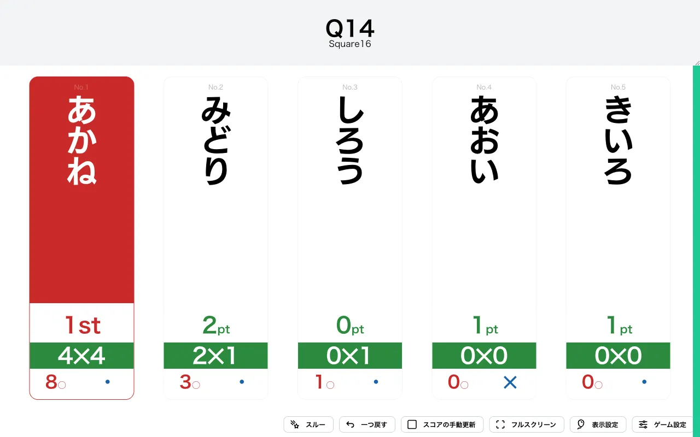

import CreateGameButton from "../../../components/CreateGameButton.astro";

奇数問目と偶数問目の正解数をかけた数が X 以上になれば勝ち抜けの形式です。

このルールでは、奇数番目に出題された問題（1 問目・3 問目・…）での正解数と、偶数番目に出題された問題（2 問目・4 問目・…）での正解数を別々に数えます。スコアはこの 2 つの正解数を**かけ算**した値になるため、片方ばかり正解していてもスコアは伸びません。両方をバランスよく正解することが求められる、二次元的な戦略性を持つ形式です。

<CreateGameButton rule="squarex" players={5} />

## ルール詳細

### スコア計算

正解した問題が**奇数問目**か**偶数問目**かによって、加算される値が分かれます。

- 奇数問目（1・3・5…問目）で正解すると「奇数側の正解数」が 1 増えます。
- 偶数問目（2・4・6…問目）で正解すると「偶数側の正解数」が 1 増えます。
- スコアは **奇数側の正解数 × 偶数側の正解数** で計算されます。

得点表示画面では、各プレイヤーの計算式（例: `2✕2`）とその積であるスコア（例: `4pt`）が表示されます。

### 勝利条件

スコアが X 以上になると勝ち抜けです。初期設定では `16` 以上で勝ち抜けとなります。たとえば奇数側・偶数側ともに 4 問ずつ正解すると `4 × 4 = 16` となり勝ち抜けます。

### 失格条件

この形式に失格はありません。誤答してもスコアは変動せず、誤答数が記録されるのみです。

### ゲーム終了

設定された人数が勝ち抜けるか、全問題が終了した時点でゲームを終了します。

## 変更可能なオプション

### X（勝ち抜けポイント）

勝ち抜けに必要なスコアを設定できます。初期値は `16` に設定されています。この値を変えると、得点表示画面の形式名も `Square16` のように連動して表示されます。

### 限定問題数の設定

詳細は限定問題数をご確認ください。

## 操作手順

1. [形式一覧](/rules/)で「SquareX」の「作る」をクリックします。
2. プレイヤーと問題セットを設定します（詳しくは[最初のゲームを作ろう](/guides/example/)）。
3. 得点表示画面で、各プレイヤーの正解／誤答ボタン（またはキーボードの数字キー／Shift＋数字キー）で採点します。奇数問目・偶数問目の区別はアプリが自動で判定します。

## スクリーンショット

### 初期状態

### プレイ中

計算式（奇数側✕偶数側）と、その積であるスコアが表示されます。片方が 0 のままだとスコアも 0 のままです。

### 勝ち抜け

スコアが X に達したプレイヤーには順位が表示されます。

## この形式で遊んでみる

下のボタンから、この形式のゲームをすぐに作成して試すことができます。

<CreateGameButton rule="squarex" players={5} />
