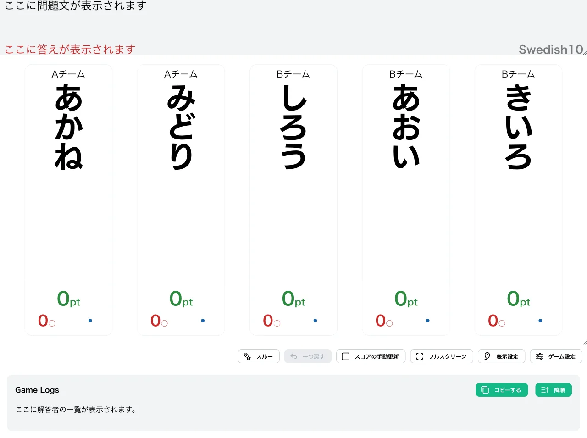
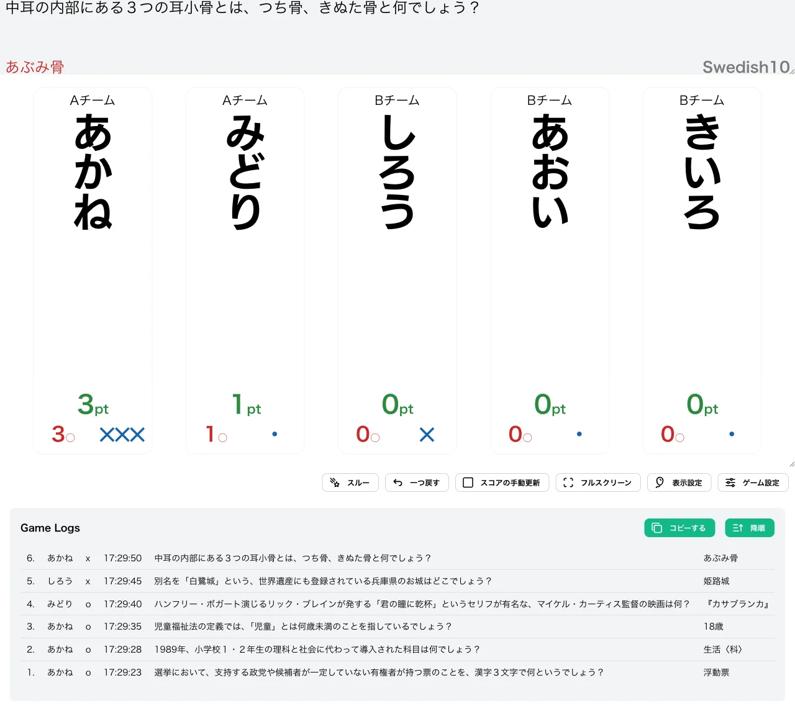
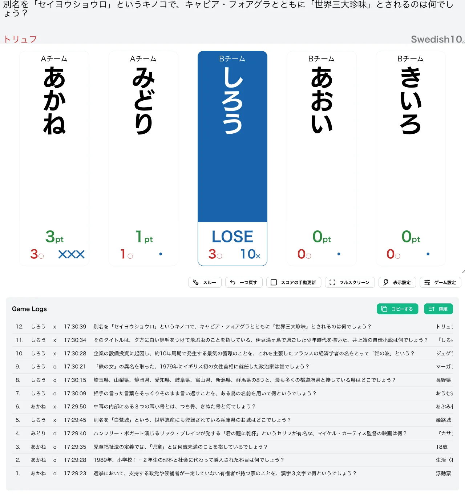
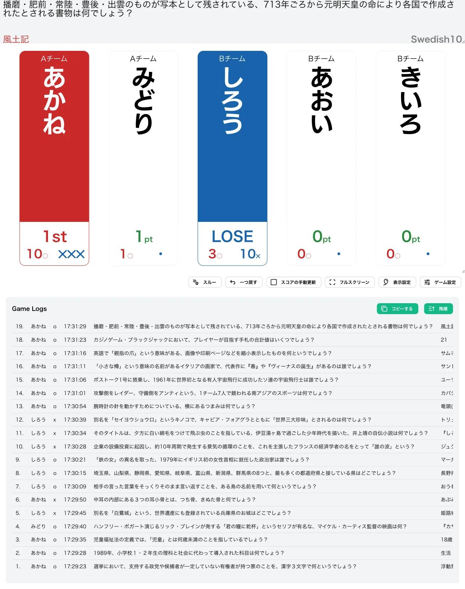

import CreateGameButton from "../../../components/CreateGameButton.astro";

正答数に応じて誤答時のダメージポイントが変動する形式です。10 回正解することで勝ち抜けとなりますが、誤答時に付与される失点（✕）は、その時点での正答数に応じて 1✕ から 4✕ まで変化します。

正解を重ねるほど 1 回の誤答による失点が大きくなるため、序盤は積極的に、終盤は慎重に、と状況に応じた判断が求められる戦略性の高い形式です。

<CreateGameButton rule="swedish10" players={5} />

## ルール詳細

### 勝利条件

正解数が勝ち抜け正解数に達すると勝ち抜けです。初期設定では 10 回正解で勝ち抜けとなります。

### 失格条件

失点の合計が失格失点数に達すると失格です。初期設定では 10✕ で失格となり、失格したプレイヤーは以降の問題に参加できません。

### 誤答時の失点

誤答時に付与される失点は、誤答した時点での正答数によって決まります。

| 誤答時の正答数 | 付与される失点 |
| --- | --- |
| 0 回 | 1✕ |
| 1〜2 回 | 2✕ |
| 3〜5 回 | 3✕ |
| 6 回以上 | 4✕ |

正解数が増えるほど誤答時のリスクが高まるため、勝ち抜けが近づくほど 1 回の誤答が致命的になります。

### ゲーム終了

設定された人数が勝ち抜けるか、全問題が終了した時点でゲームを終了します。

## 変更可能なオプション

### 勝ち抜け正解数

勝ち抜けに必要な正解数を設定できます。初期値は `10` に設定されています。

### 失格失点数

失格となる失点数を設定できます。初期値は `10` に設定されています。

### 限定問題数の設定

詳細は限定問題数をご確認ください。

## 操作手順

1. [形式一覧](/rules/)で「Swedish10」の「作る」をクリックします。
2. プレイヤーと問題セットを設定します（詳しくは[最初のゲームを作ろう](/guides/example/)）。
3. 得点表示画面で、各プレイヤーの正解／誤答ボタン（またはキーボードの数字キー／Shift＋数字キー）で採点します。

## スクリーンショット

### 初期状態

全プレイヤーが 0pt・失点なしの状態でゲームが始まります。

### プレイ中

誤答時の失点は、その時点での正答数によって変わります。下の例では、3 問正解した後に誤答した「あかね」には 3✕ が付いているのに対し、正答 0 の時点で誤答した「しろう」は 1✕ で済んでいます。

### 失格

失点の合計が失格失点数に達したプレイヤーは「LOSE」と表示され、以降採点できなくなります。下の例では、「しろう」が 3 問正解した後に誤答を重ね、失点の合計が 10✕ に達して失格となっています。

### 勝ち抜け

正解数が勝ち抜け正解数に達したプレイヤーには順位が表示されます。下の例では、「あかね」が 10 問正解して 1 位で勝ち抜けています。

## この形式で遊んでみる

下のボタンから、この形式のゲームをすぐに作成して試すことができます。

<CreateGameButton rule="swedish10" players={5} />
