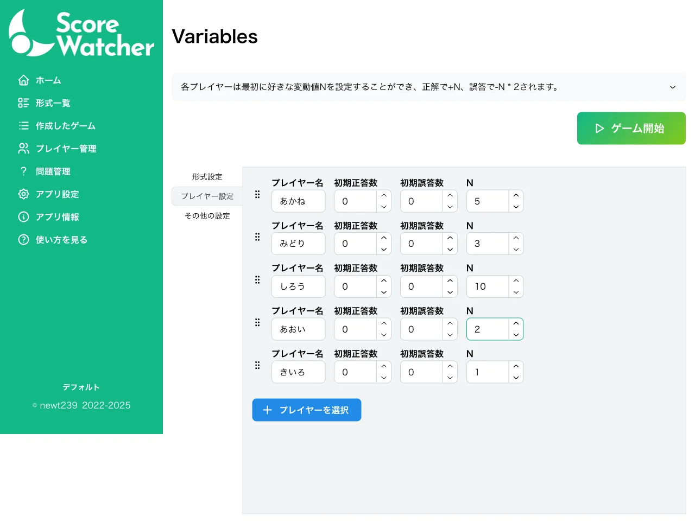
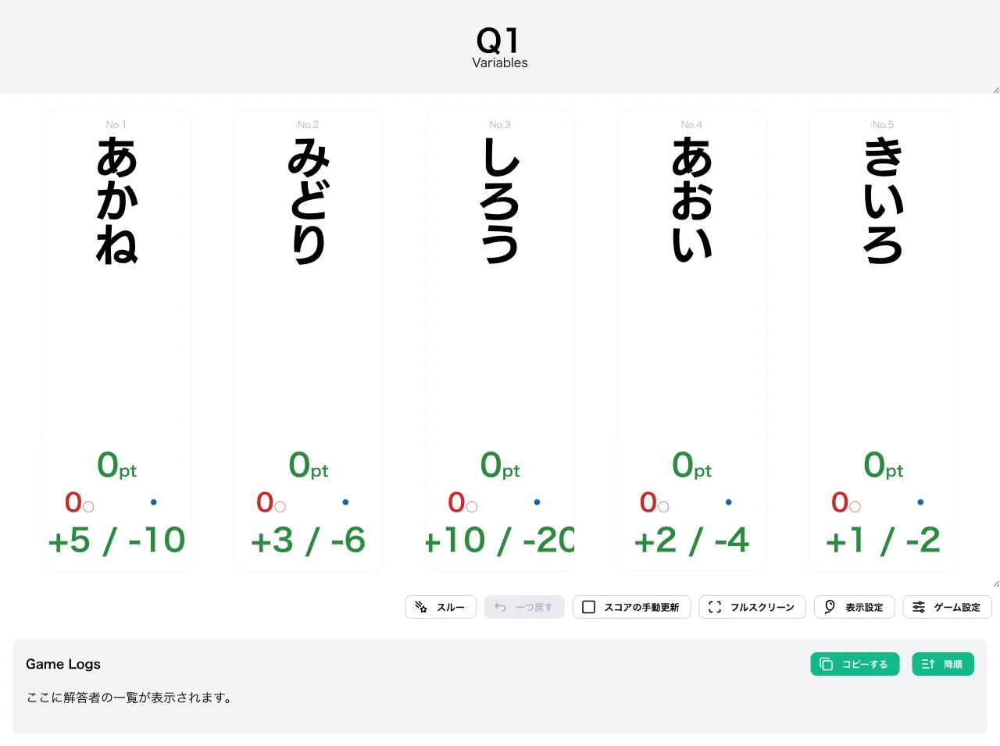
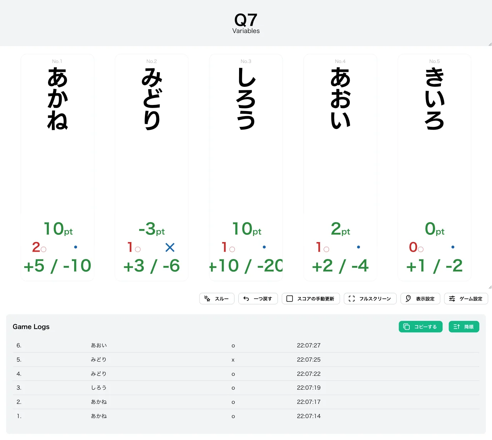
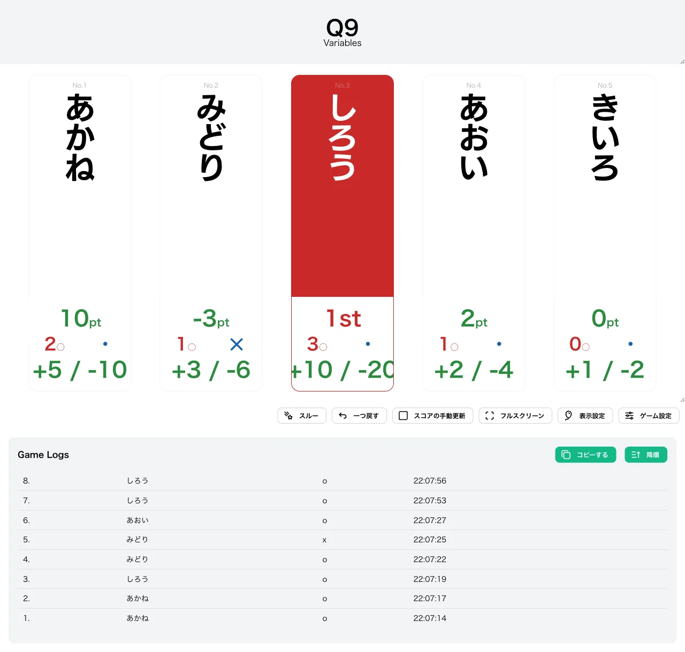

import { Aside } from "@astrojs/starlight/components";

import CreateGameButton from "../../../components/CreateGameButton.astro";

各プレイヤーがゲーム開始前に自分だけの「変動値 N」を設定できる形式です。正解すると **+N**、誤答すると **-N×2** とスコアが変動します。

N を大きくするほど一度の正解で大きく加点できますが、その反面、誤答時の失点はさらに大きく（N の 2 倍）なります。リスクとリターンをどう取るか、プレイヤーごとの戦略が問われる形式です。

<CreateGameButton rule="variables" players={5} />

## ルール詳細

### スコア変動

各プレイヤーはスコア **0** からゲームを開始します。

- **正解時**: そのプレイヤーに設定された変動値 N の分だけスコアが増えます（**+N**）。
- **誤答時**: 変動値 N の **2 倍**だけスコアが減ります（**-N×2**）。誤答によってスコアがマイナスになることもあります。

たとえば N＝5 のプレイヤーは、正解で +5、誤答で -10 されます。

### 勝利条件

スコアが **勝ち抜けポイント**（初期値 30）に到達すると勝ち抜けです。勝ち抜けたプレイヤーには順位（1st・2nd …）が表示されます。

### 失格について

この形式に失格の概念はありません。スコアがマイナスになっても解答を続けられ、全プレイヤーが最後まで参加できます。

## 変更可能なオプション

### 変動値 N（プレイヤーごと）

各プレイヤーの変動値 N を、ゲーム開始前のプレイヤー設定で個別に設定します（初期値 `1`）。正解時の加点（+N）と誤答時の失点（-N×2）の大きさを決める、この形式の中心となる設定です。

### 勝ち抜けポイント

勝ち抜けに必要なスコアを設定できます。初期値は `30` で、`3`〜`1000` の範囲で指定できます。

### 限定問題数の設定

出題する問題数を制限できます（共通設定）。

## 操作方法

1. [形式一覧](/rules/)で「Variables」の「作る」をクリックします。
2. プレイヤーと問題セットを設定します（詳しくは[最初のゲームを作ろう](/guides/example/)）。
3. 「プレイヤー設定」タブで、各プレイヤーの **変動値 N** を設定します。
4. 得点表示画面で、各プレイヤーの正解／誤答ボタン（またはキーボードの数字キー／Shift＋数字キー）で採点します。

得点表示画面では、各プレイヤーの現在のスコアが「◯pt」形式で表示され、その下に正解数・誤答数と、設定した変動値が「+N / -N×2」の形（例: `+5 / -10`）で表示されます。

## スクリーンショット

### 変動値 N の設定（ゲーム設定画面）

プレイヤー設定タブで、各プレイヤーの変動値 N を個別に入力します。

### 初期状態

各プレイヤーの下部に、設定した変動値が「+N / -N×2」の形で表示されます。

### プレイ中

正解で +N、誤答で -N×2 がそれぞれ加減算されます。下の例では、みどり（N＝3）が 1 回正解・1 回誤答して `+3-6＝-3pt` となっています。

### 勝ち抜け

スコアが勝ち抜けポイントに到達したプレイヤーは、色が変わり順位（1st など）が表示されます。

## この形式で遊んでみる

下のボタンから、この形式のゲームをすぐに作成して試すことができます。

<CreateGameButton rule="variables" players={5} />
